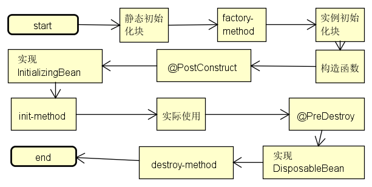

# `Spring`核心功能

## `DI(IOC)`

### 何谓`DI(IOC)`

DI(依赖注入)是spring的核心功能之一。
`Dependency Injection` 和 `Inversion of Control` 其实就是一个东西的两种不同的说法而已。本质上是一回事。`Dependency Injection` 是一个程序设计模式和架构模型， 一些时候也称作 `Inversion of Control`，尽管在技术上来讲，`Dependency Injection` 是一个 `Inversion of Control` 的特殊实现，`Dependency Injection` 是指一个对象应用另外一个对象来提供一个特殊的能力，例如：把一个数据库连接以参数的形式传到一个对象的结构方法里面而不是在那个对象内部自行创建一个连接。Inversion of Control 和 Dependency Injection 的基本思想就是把类的依赖从类内部转化到外部以减少依赖。 应用Inversion of Control，对象在被创建的时候，由一个调控系统内所有对象的外界实体，将其所依赖的对象的引用，传递给它。也可以说，依赖被注入到对象中。所以，Inversion of Control 是，关于一个对象如何获取他所依赖的对象的引用，这个责任的反转。IoC是通过处理对象定义依赖的方式来工作，也就是说，一起协作的对象，要么通过构造函数参数来获得，要么在构造之后给对象设置属性来获得，要么从工厂方法返回的方式来获得。容器先创建bean，然后再注入这些依赖。这个获取过程是完全反过来的，所以命名为控制反转(IoC)。
DI能够删除任何特定的依赖于别的类或第三方接口的类，并且能够在初始化构造时加载要依赖的类。DI的优点是你可以依赖类的实现而并不需要更改你的代码。你甚至可以在接口不变的条件下重写依赖的实现而不用改变你的编码，即面向接口的编程。

### `DI`实现方式

1. 构造器注入：通过构造器注入，能使当前实例作为不可变对象，并且能确保所有需要的依赖都是非空的.更进一步，构造器注入返回给客户代码的是一个完全初始化状态的对象.
2. Setter方法注入：Setter方法注入作为构造器注入的补充实现.能注入可选的有默认值的依赖.否则，会随处校验依赖的非空与否.
3. 自动装配
   * `@Autowired`:即通过注解自动装配，默认方式是`byType`.
   * `@Resource`:即通过注解自动装配，默认方式是`byName`.
   * `@javax.inject.Inject`:类似与`@Autowired`
   * `@Qualifier`:指定实现不同的限定符，在具体注入时，通过该注解具体限定

Spring容器会在容器加载时校验依赖非空和循环依赖.在初始化Bean时，Spring会在bean真正创建之前尽可能晚的设置属性和解决依赖关系.

## `bean`

### `bean`定义和依赖实现方式

#### `XML `文本配置文件

````
<beans>
<bean id="beanId" class="com.example.ClassName"></bean>
</beans>
````

通过上面的方式来定义一个`bean`，通过在bean中添加依赖来达到目的.

**主要依赖方式有：**

1. 构造器注入.
2. Setter属性方法注入

通过`XML`配置文件构造`Spring beans`和依赖缺失了编译时的类型检查，比如构造器参数的类型错误，甚至是构造器错误的参数只有在`ApplicationContext`容器在运行时构造时才会检查。
#### 使用注解

通过配置自动注解扫描的根包，并且在`bean`上使用注解`@Component(@Service,@Repositoty，@javax.inject.Named)`等标示他是一个`bean`.
```xml
   <!-- 开启注解配置 即Autowried -->  
    <context:annotation-config/>  
    <!--    使用自动注入的时候要  添加他来扫描bean之后才能在使用的时候   -->
    <context:component-scan base-package="com.wyp.module.service,com.wyp.module.dao"/>  
```
通过如上配置自动扫描根包下的类，并作自动注解绑定

***解释下`<context:annotation-config/>`***：

>它的作用是隐式的向`Spring`容器注册
>
>```java
> AutowiredAnnotationBeanPostProcessor,
> CommonAnnotationBeanPostProcessor,
> PersistenceAnnotationBeanPostProcessor,
> RequiredAnnotationBeanPostProcessor 
>```
>
> 这4个`BeanPostProcessor`.注册这4个bean处理器主要的作用是为了你的系统能够识别相应的注解。
> 如果想使用`@Autowired`,`@PersistenceContext`,`@Required`,`@Resource`,`@PostConstruct`,`@PreDestroy`,就需要按照传统声明一条一条去声明注解Bean，就会显得十分繁琐.
> 因此如果在Spring的配置文件中事先加上`<context:annotation-config/>`这样一条配置的话，那么所有注解的传统声明就可以被忽略，即不用在写传统的声明，Spring会自动完成声明。

***解释下`<context:component-scan/>`***：

> 作用是让Bean定义注解工作起来,也就是上述传统声明方式.它的base-package属性指定了需要扫描的类包，类包及其递归子包中所有的类都会被处理。
>
>  值得注意的是`<context:component-scan/>`不但启用了对类包进行扫描以实施注释驱动 Bean 定义的功能，同时还启用了注释驱动自动注入的功能（即还隐式地在内部注册了`AutowiredAnnotationBeanPostProcessor`
>
>  和`CommonAnnotationBeanPostProcessor`），因此当使用`<context:component-scan/>`后，就可以将`<context:annotation-config/>`移除了。

```java
@Autowired
private UserService userService;
	
@Service("userService")
public class UserServiceImpl implements UserService
```
通过如上配置定义一个`bean`，并作自动绑定

**主要注解依赖方式有：**

- `@Autowired`:即通过注解自动装配，默认方式是`byType`.
- `@Resource`:即通过注解自动装配，默认方式是`byName`.
- `@javax.inject.Inject`:类似与`@Autowired`

当通过`@Autowired`注入时，默认是通过类型匹配具体的实现类的，但是如果接口有多个实现类，Spring容器是没法做选择的，有两种方式解决这个问题：

1.	`@Primary`注解，指定当有多个候选实现时，首选这个实现.
    2.`@Qualifier`注解指定不同实现不同的限定符，在具体注入时，通过该注解具体限定.


 ***解释下`@Autowired`***：

> 可以对成员变量、方法和构造函数进行标注，来完成自动装配的工作。`@Autowired`的标注位置不同。
>
>  它们都会在Spring在初始化这个bean时，自动装配这个属性。注解之后就不需要`set/get`方法了。

其中`@Inject` 和`@Named`是`JSR 330 Standard Annotations`.s

#### 通过Spring提供的扩展方式做处理

1. 可以通过`init-method`的方式来实现初始化注入，还可以通过实现``InitializingBean`接口来实现，但此种方式对业务代码有侵入性，少用。
2. bean加载过程可以通过设置`factory-method`的方式设置工厂方法，来设置一些静态属性
3. 调用`getter`方法，用工厂`Bean  PropertyPathFactoryBean`
4. 调用普通方法(实例方法或者类方法)，用工厂`Bean  MethodInvokingFactoryBean`
5. 获取Field的值，用工厂`Bean FieldRetrievingFactoryBean`

#### `@Configuration`&`@Bean`

`@Bean`可以出现在`@Configuration`or`@Component`，其中`@Configuration`类似于xml中的`<beans>`,而`@Component`类似于xml中的`<bean>`,`@Component`可以作为`@Configuration`的替代。

*但是有一些问题：当我们使用`@Bean`注解在例如`@Component`作用的class里面时，将会发生一种称之为注解`@Bean`的`lite mode`出现，这种不会使用`CGLIB`代理.所以只要我在`@Bean`修饰的方法之间不相互编码调用，代码将会很好的运作.*

下面是**`@Bean`的`lite mode`**示例：
```java
    @Component
    public class ConfigInComponent {
    
        @Bean
        public SimpleBean simpleBean() {
            return new SimpleBean();
        }
    
        @Bean
        public SimpleBeanConsumer simpleBeanConsumer() {
            return new SimpleBeanConsumer(simpleBean());
        }
    }
```

*上述代码在`new SimpleBeanConsumer(simpleBean())`这一步实例化`bean`时，不会将第一步`@Bean`实例化的bean自动注入到`simpleBeanConsumer`bean中，而是重新用`simpleBean()`，生成一个新的`SimpleBean` 实例*.而`@Configuration`则不会发生上述情况,代码如下：

```java
    @Configuration
    public class ConfigInConfiguration {
    
        @Bean
        public SimpleBean simpleBean() {
            return new SimpleBean();
        }
    
        @Bean
        public SimpleBeanConsumer simpleBeanConsumer() {
            return new SimpleBeanConsumer(simpleBean());
        }
    }
```

要改善上述问题，可以通过以下方式实现：

```java
    @Component
    public class ConfigInComponent {
    
        @Autowired
        SimpleBean simpleBean;
    
        @Bean
        public SimpleBean simpleBean() {
            return new SimpleBean();
        }
    
        @Bean
        public SimpleBeanConsumer simpleBeanConsumer() {
            return new SimpleBeanConsumer(simpleBean);
        }
    }
```

通过将`@Bean`生成的bean Autowired到属性上，并在`@Bean`实例化`SimpleBeanConsumer`bean时传入此属性，来达到目的.

**参考**：    [Spring @Configuration vs @Component](http://dimafeng.org/2015/08/29/spring-configuration_vs_component)

### `bean`生命周期



### `bean`的作用域

1. `session`
2. `request`
3. `prototype`
4. `singleton`
5. `application`

*其中`singleton`是容器级别的，即一个容器一个bean实例,spring的单例实例缓存在ConcurrentHashMap中;而GOF的单例模式是基于ClassLoader的，即一个类加载器只能有一个实例*

### 通过bean后处理来增强功能

#### `BeanFactoryPostProcessor`

通过实现`BeanFactoryPostProcessor`，对bean配置的元数据做一些处理(可以改变初始化bean的内容)，比如为安全考虑的数据库密码加密配置在配置文件中，在jdbc连接数据库时需要解密可以通过扩展`BeanFactoryPostProcessor`来实现.

```java
@Component
public class CustomBeanFactoryPostProcessor implements BeanFactoryPostProcessor, Ordered {
    @Override
    public void postProcessBeanFactory(ConfigurableListableBeanFactory beanFactory) throws BeansException {
        BeanDefinition definition = beanFactory.getBeanDefinition("xmlBeanDefinition");
        MutablePropertyValues propertyValues=definition.getPropertyValues();
        if (propertyValues.contains("name")) {
            PropertyValue property=propertyValues.getPropertyValue("name");
            String name=((TypedStringValue) property.getValue()).getValue();
            propertyValues.add("name",name.replace(" ",""));
        }

        if (propertyValues.contains("age")) {
            PropertyValue property=propertyValues.getPropertyValue("age");
            Double age=Double.parseDouble(((TypedStringValue) property.getValue()).getValue());
            propertyValues.add("age",Math.round(age));
        }
    }

    @Override
    public int getOrder() {
        return 3;
    }
}
```

如上，可以通过实现`Ordered`或者注解`@Order`的方式来指定加载顺序.

#### `BeanPostProcessor`

通过实现`BeanPostProcessor`，可以实现在Spring容器在完成Bean的实例化，配置和其他的初始化前后做一些自己的业务处理，比如我们可以统计自定义的的Bean集合.

```java
@Component
public class CustomBeanPostProcessor implements BeanPostProcessor {
    @Override
    public Object postProcessBeforeInitialization(Object bean, String beanName) throws BeansException {
        if(beanName.equals("userService")){
            UserService ds=(UserService) bean;
            System.out.println(ds);
        }
        return bean;
    }

    @Override
    public Object postProcessAfterInitialization(Object bean, String beanName) throws BeansException {
        if(beanName.equals("userService")){
            UserService ds=(UserService) bean;
            System.out.println(ds);
        }
        return bean;
    }
}
```

## AOP(面向切面的编程)

AOP(面向切面的编程)是通过划分关注点，来做一些事，这些事在实际编程中与整体业务无关，比如事务控制，日志管理等,通过aop将其与业务代码解耦，以实现精简的业务编码.其整体描述为`在什么时候做什么事`.

AOP三要素: 

* 方面（Aspect）--多个通知和切点的集合


* 切入点（Pointcut）--在什么地方
* 通知(增强处理)（Advice）--在什么时候干什么事
   * 比如有`MethodInterceptor`,`AfterAdvice`,`BeforeAdvice`等.描述的是在什么时候做一些增强处理.

在**编程配置**中,如下：

```xml
<bean id="methodAdvice" class="com.earthlyfish.aop.EhcacheAroundAdvice">
	<property name="cache" ref="methodCache"></property>
	</bean>

	<!-- 配置切点,通知 -->
	<aop:config>
		<aop:pointcut
			expression="(execution(public * com.earthlyfish.service..get*(..))) or (execution(public * com.earthlyfish.service..find*(..)))"
			id="methodCachePoint" />
		<aop:advisor advice-ref="methodAdvice" pointcut-ref="methodCachePoint" />
	</aop:config>
```

<aop:pointcut>：用来定义切入点，该切入点可以重用

<aop:advisor>:用来定义只有一个通知和一个切入点的切面

<aop:aspect>：用来定义切面，该切面可以包含多个切入点和通知，而且标签内部的通知和切入点定义是无序的；和advisor的区别就在此，advisor只包含一个通知和一个切入点

## 事务管理

Spring通过`TransactionManager`来实现事务管理，现有两种方式，一种是通过aop注入式的方式实现，另一种是通过`@Transactional`在方法上实现事务管理.
###aop注入式
```xml
    <bean id="txManager"
	class="org.springframework.jdbc.datasource.DataSourceTransactionManager">
		<property name="dataSource" ref="dataSource" />
	</bean>

    <tx:advice id="txAdvice" transaction-manager="txManager">
		<tx:attributes>
			<tx:method name="query*" read-only="true" propagation="REQUIRED" />
			<tx:method name="get*" read-only="true" propagation="REQUIRED" />
			<tx:method name="create*" propagation="REQUIRED"
				rollback-for="java.lang.Exception,java.lang.RuntimeException" />
			<tx:method name="add*" propagation="REQUIRED"
				rollback-for="java.lang.Exception,java.lang.RuntimeException" />
			<tx:method name="save*" propagation="REQUIRED"
				rollback-for="java.lang.Exception,java.lang.RuntimeException" />
			<tx:method name="update*" propagation="REQUIRED"
				rollback-for="java.lang.Exception,java.lang.RuntimeException" />
			<tx:method name="delete*" propagation="REQUIRED"
				rollback-for="java.lang.Exception,java.lang.RuntimeException" />
			<tx:method name="remove*" propagation="REQUIRED"
				rollback-for="java.lang.Exception,java.lang.RuntimeException" />
			<tx:method name="*" propagation="REQUIRED" />
		</tx:attributes>
	</tx:advice>

	<aop:config>
		<!--切入点指明了在所有方法产生事务拦截操作  -->
		<aop:pointcut id="module-pointcut"
			expression="execution(* com.wyp.module.service.*.*(..))" />
		<!--定义了将采用何种拦截操作，这里引用到 txAdvice,即在什么时候做什么事  -->
		<aop:advisor advice-ref="txAdvice" pointcut-ref="module-pointcut" />
	</aop:config>
```
###`@Transactional`
需要在配置文件中有tx相关的注解.
```xml
<!-- 此注解表示声明式事务，在方法上通过@Transactional控制事务 -->
    <tx:annotation-driven transaction-manager="txManager" />
```
在需要的地方通过`@Transactional`注入:
```java
@Transactional(propagation=Propagation.REQUIRED)
	public UserType registerUser(Customer customer) {
```
对于这种方式，如果一个类里面有两个方法A和B，A方法调用了B方法，如果调用A方法的话,整个事务运用会有下面三种情况：

1. A上加了注解，B上不加，则整体会受事务控制.
2. A上加了注解，B上加，则整体会受事务控制.其实这里调用和1一样，在AOP代理时只给A方法加了环绕事务通知.
3. A上不加注解，B上加，则整体不受事务控制.这是因为调用A方法时由于没有判断到事务注解的存在，因此代理类没有声称事务控制的字节码，这直接使用的被代理类的字节码，所以不受事务控制.

### 编码式

编码式通过在代码中加入事务管理来达到目的，但由于事务逻辑与主业务逻辑没啥关系，代码没必要紧耦合在一起，所以此方法不怎么使用.

## JPA知识点

### `mapping pojo`结构详述

啥事不干，先上一个多对多关系的例子.

```java
@Entity
@Table(name = "t_role")
public class Role {

    @Id
    @GeneratedValue(strategy = GenerationType.AUTO)
    private Long id;

    @Column(name = "role_name")
    private String roleName;

    @Column(name = "role_description")
    private String roleDescription;

    @Column
    private boolean enabled;

    //角色下的所用用户
    @JsonIgnore
    @ManyToMany(mappedBy = "roles")
    private Set<User> users = new HashSet<>();
```

```java
@Entity
@Table(name = "t_user")
public class User implements Serializable, Cloneable {

    /**
     * 静态long类型常量serialVersionUID的作用：
     * <p>
     * 显示的设置serialVersionUID值就可以保证版本的兼容性，如果你在类中写上了这个值，就算类变动了，
     * 它反序列化的时候也能和文件中的原值匹配上。而新增的值则会设置成零值，删除的值则不会显示。
     */
    private static final long serialVersionUID = -8220100956296048447L;

    @Id
    @GeneratedValue
    private Long id;

    @Column(unique = true)
    private String name;

    @Column(length = 32)
    private String password;

    @Column(length = 32)
    private String salt;

    @Column(precision = 3)
    private int age;

    /**
     * 关系维护端，负责多对多关系的维护
     *
     * @JoinTable 表示关联表的信息，其中：
     * 1.name 表示关联表的名字
     * 2.joinColumns 指定外键的名字，关联到关系维护端Role
     * 3.inverseJoinColumns 指定外键的名字，要关联的关系被维护端
     * 以上完全可以默认，默认情况下：
     * 1.name 主表名_从表名
     * 2.joinColumns 主表_id
     * 3.inverseJoinColumns 从表_id
     */
    @ManyToMany
    @JoinTable(name = "t_user_role", joinColumns = @JoinColumn(name = "user_id"),inverseJoinColumns = @JoinColumn(name = "role_id"))
    private Set<Role> roles = new HashSet<>();
```

上述两端代码描述的是`Role`和`User`的多对多关系.

**注解说明**

1. `mappedBy`

   `mappedBy`和`inverse`的作用是相同的，只不过`inverse`用在xml文件中，表示的意思是在关系双方都有关系维护任务时，以哪一方为主导，即没有被`mappedBy`修饰的一方维护.即外键将储存在没有被`mappedBy`修饰一方.

2. `@Temporal`
   `@Temporal`是将`java.sql.*`下的`Data`等转成`java.util.*`包下的`Date`.

3. `@Transient`

    `@Transient`标记该字段不记录到数据结构

### 初始化数据结构和数据

可以通过设置`hibernate.hbm2ddl.auto`的值来达到初始化数据结构的目的，有以下几个值.

1. `create `  ： 每次加载JPA，重新创建数据库表结构，这就是导致数据库表数据丢失的原因
2. `create-drop`  ：加载JPA时创建，退出是删除表结构
3. `update`  ：加载JPA自动更新数据库结构
4. `none`/`validate`  :加载JPA时，验证创建[数据库](http://lib.csdn.net/base/mysql)表结构,当然none时不做任何操作

在本机开发调试初始化数据的时候可以选择`create`、`update`等。


但是应用发布正式版本的时候，对数据库现有的数据或表结构进行自动的更新是很危险的。此时此刻应该由DBA同志通过手工的方式进行后台的数据库操作。

hibernate.hbm2ddl.auto的值建议是`none`或`validate`。`validate`应该是最好的选择：这样 [spring](http://lib.csdn.net/base/javaee)在加载之初，如果model层和数据库表结构不同，就会报错，这样有助于技术运维预先发现问题。

*当然我们可以通过自定义初始化脚本的方式来实现初始化数据*：

通过`data: classpath:/database/import.sql`的方式来实现--`Spring boot`亲测通过

### 遇到的问题

1. `Spring MVC`转换`JPA`多对多对象的`json`时，无限循环问题

    在使用JPA处理多对多关系时，发生了无限循环的问题，代码如下：

   ```java
   　　@Entity
      @Table(name = "t_menu")
      public class Menu implements Comparable<Menu> {
          @Id
          @GeneratedValue(strategy = GenerationType.AUTO)
          private long id;
          private String menuName;
          private String menuDesc;
          private int priority;
          private String staticIndex;
          private int parantId;
          private boolean enabled;
          @Transient
          private List<Menu> children;
      
          //菜单所属role
          @ManyToMany(mappedBy = "roleMenus", fetch = FetchType.LAZY)
          private Set<Role> roles = new HashSet<>();
      
          //菜单所属role
          @ManyToMany(mappedBy = "userMenus", fetch = FetchType.LAZY)
          private Set<User> users = new HashSet<>();
          }
   ```
   上面转换成json数据时，出现无限循环以致栈溢出．
   针对以上问题可以通过以下注解实现：
   1. @JsonIgnore json转换时忽略某个属性，以断开无限递归，序列化和反序列化均忽略，可以用在字段或get(序列化),set(反序列化)方法上
   2. @JsonBackReference json转换时忽略某个属性，以断开无限递归，序列化时忽略，可以用在字段或get(序列化),set(反序列化)方法上，序列化时,相当于@JsonIgnore
   3. @JsonManagedReference json转换时会被序列化，反序列化时，如果没有该注解，则不会自动注入@JsonBackReference标注的属性

   使用如下：
   ```java
      //菜单所属role
       @JsonIgnore
       @ManyToMany(mappedBy = "roleMenus", fetch = FetchType.LAZY)
       private Set<Role> roles = new HashSet<>();

       //菜单所属role
       @JsonBackReference
       @ManyToMany(mappedBy = "userMenus", fetch = FetchType.LAZY)
       private Set<User> users = new HashSet<>();
   ```

## spring mvc

###Configuring a servlet container

#### 通过配置文件实现

通过`org.springframework.web.servlet.DispatcherServlet`管理，在`web.xml`里面配置：
```xml
<servlet>
        <servlet-name>rest</servlet-name>
        <servlet-class>org.springframework.web.servlet.DispatcherServlet</servlet-class>
        <init-param>  
	      <param-name>contextConfigLocation</param-name>  
          <param-value>/WEB-INF/rest-servlet.xml</param-value>  
	</init-param>
	<!-- 这个配置文件在容器启动的时候 就加载 -->
    <load-on-startup>1</load-on-startup>
    </servlet>
    <servlet-mapping>
        <servlet-name>rest</servlet-name>
        <url-pattern>/</url-pattern>
    </servlet-mapping>
```
如果
```xml
    <init-param>  
	      <param-name>contextConfigLocation</param-name>  
          <param-value>/WEB-INF/rest-servlet.xml</param-value>  
	</init-param>
```
不指定，则默认会加载该文件` WEB-INF/[servlet-name]-servlet.xml`.

通过这个`web.xml`，引出了另一个问题，即`web.xml`文件的加载顺序是什么样的？
通过查看tomcat源码，tomcat加载web.xml的顺序是:
```
context-param ---> listener ---> filter ---> servlet
```
首先tomcat会生成一个程序应用级`ServletContext`,全局唯一，其中将`context-param`放在第一位主要是listener和filter会用到配置的初始化参数，
比如Spring配置的`contextConfigLocation`,在`ContextLoaderLister`加载时会从`ServletContext`的初始化参数中获取配置文件，进行bean的初始化操作.
上面还有一点，那就是`servlet`的加载，当`load-on-startup`大于等于0时，表示在tomcat容器启动时加载这个`Servlet`,否则，在第一次使用时才加载.

解释下**`<mvc:annotation-driven />`**

>`<mvc:annotation-driven />` 是一种简写形式，完全可以手动配置替代这种简写形式。`<mvc:annotation-driven />`
>会自动注册`DefaultAnnotationHandlerMapping`与`AnnotationMethodHandlerAdapter` 两个bean,是`spring MVC`为`@Controllers`分发请求所必须的。

#### 零配置实现

从`servlet3.0`开始，`web`支持*`no web.xml`*实现容器的初始化工作，是得于`javax.servlet.ServletContainerInitializer`对初始化工作的支持.

`spring`通过实现`javax.servlet.ServletContainerInitializer`，重写`onStartUp`方法,来提供无`xml`文件的`spring`容器初始化工作.下面是一个`spring`实现初始化的例子.

```java
import java.util.EnumSet;

import javax.servlet.DispatcherType;
import javax.servlet.ServletContext;
import javax.servlet.ServletException;

import org.springframework.web.WebApplicationInitializer;
import org.springframework.web.context.ContextLoaderListener;
import org.springframework.web.context.support.AnnotationConfigWebApplicationContext;
import org.springframework.web.filter.CharacterEncodingFilter;

import cn.oracle.action.AppConfig;

public class DefaultConfigration implements WebApplicationInitializer {

	@Override
	public void onStartup(ServletContext container) throws ServletException {

		// 配置Spring提供的字符编码过滤器
		javax.servlet.FilterRegistration.Dynamic filter = container.addFilter("encoding",
				new CharacterEncodingFilter());
		// 配置过滤器的过滤路径
		filter.addMappingForUrlPatterns(EnumSet.of(DispatcherType.REQUEST), true, "/");

		// 基于注解配置的Spring容器上下文
		AnnotationConfigWebApplicationContext rootContext = new AnnotationConfigWebApplicationContext();
		// 注册Spring容器配置类
		rootContext.register(AppConfig.class);
		container.addListener(new ContextLoaderListener(rootContext));		
	}
}
```

具体的`AppConfig`相当于原来的`application-*.xml`等`spring`的配置文件处理.如下：

```java
import org.springframework.context.annotation.ComponentScan;
import org.springframework.context.annotation.Configuration;

@Configuration
@ComponentScan(basePackages = {"cn.oracle.*"})
public class AppConfig {
	
}
```

可以再此基础上扩展，编写一个`no without xml`的app.

从上可以看到`WebApplicationInitializer`是一个接口，和`ServletContainerInitializer`没有关系，下面看一下具体的细节.

下面这一段代码是`spring`做处理的过程.

```java
@HandlesTypes({WebApplicationInitializer.class})
public class SpringServletContainerInitializer
  implements ServletContainerInitializer
{
  public void onStartup(Set<Class<?>> webAppInitializerClasses, ServletContext servletContext)
    throws ServletException
  {
    List initializers = new LinkedList();

    if (webAppInitializerClasses != null) {
      for (Class waiClass : webAppInitializerClasses)
      {
        if ((!waiClass.isInterface()) && (!Modifier.isAbstract(waiClass.getModifiers())) && 
          (WebApplicationInitializer.class
          .isAssignableFrom(waiClass))) {
          try
          {
            initializers.add((WebApplicationInitializer)waiClass.newInstance());
          }
          catch (Throwable ex) {
            throw new ServletException("Failed to instantiate WebApplicationInitializer class", ex);
          }
        }
      }
    }
```

可以看到`SpringServletContainerInitializer`实现了`SpringServletContainerInitializer`,而`spring`通过注解`@HandlesTypes({WebApplicationInitializer.class})`来实现扫描`WebApplicationInitializer`该类，并将其注入到`Set集`.

**注** ：*`@HandlesTypes` is used to declare the class types that a `ServletContainerInitializer` can handle.*

一些链接：

* [基于纯Java代码的Spring容器和Web容器零配置的思考和实现（3） - 使用配置](https://my.oschina.net/devleon/blog/530953)
* [AOP那些事](https://my.oschina.net/huangyong/blog/161338)


### `Spring validator`

不说其他的，先看代码-->

第一步：定义一个Validator

```java
@Component
public class UserCUValidator implements Validator {

    private UserService userService;

    @Autowired
    public UserCUValidator(UserService userService) {
        this.userService = userService;
    }

    @Override
    public boolean supports(Class<?> clazz) {
        return UserDomain.class.isAssignableFrom(clazz)
                || User.class.isAssignableFrom(clazz);
    }

    @Override
    public void validate(Object target, Errors errors) {
        if (target instanceof UserDomain) {
            UserDomain domain = (UserDomain) target;
            if (StringUtils.isNullOrEmpty(domain.getUser().getName())
                    || StringUtils.isNullOrEmpty(domain.getUser().getPassword())
                    || StringUtils.isNullOrEmpty(domain.getRePwd())) {
                errors.rejectValue("user.field", "user.field.invalid", "user field is invalid");
                return;
            }

            if (!domain.getUser().getPassword().equals(domain.getRePwd())) {
                errors.rejectValue("user.password.different", "user.password.different", "user password is different");
                return;
            }
        } else if (target instanceof User) {
            ValidationUtils.rejectIfEmpty(errors, "name", "name.empty");
            ValidationUtils.rejectIfEmpty(errors, "password", "password.empty");
        }

    }
}
```

第二步：使用Validator

```java
@RestController
@RequestMapping("/users")
public class UserController {

    @Inject
    private UserService userService;

    @Autowired
    private UserCUValidator userCUValidator;

    /**
     * 在Spring的数据绑定器中进行注册，而注册时机是特定于控制器的
     *
     * @param binder
     */
    @InitBinder
    protected void initBinder(WebDataBinder binder) {
        binder.addValidators(userCUValidator);
    }

    @RequestMapping(value = "/login", method = RequestMethod.POST)
    public ResponseEntity loginUser(@RequestBody @Valid User user, HttpServletRequest request) {
        ResponseEntity responseEntity = userService.loginUser(user);
        if (Boolean.parseBoolean(responseEntity.getFlag())) {
            user.setPassword(null);
            HttpSession session = request.getSession();//sample as request.getSession(true)
            session.setAttribute(CommonConstant.SESSION_CURRENT_USER, user);
        }
        return responseEntity;
    }
```

很简单,原理就是在映射到具体的方法后，优先validator校验.

# `Spring boot`

## 关于启动时注解

```java
@SpringBootApplication
@ComponentScan(basePackages = "com.wyp.boot.earthlyfisher")
public class BootEntry {

    /**
     * 1.If you need to find out what auto-configuration is currently being
     * applied, and why, start your application with the --debug switch .<br/>
     *
     * @param args
     */
    /**
     * @param args
     */
    public static void main(String[] args) {
        // SpringApplication.run(BootEntry.class, setBootArgs(args));

        SpringApplication application = new SpringApplication(BootEntry.class);
        /*
         * Banner.Mode.OFF:关闭; Banner.Mode.CONSOLE:控制台输出，默认方式;
		 * Banner.Mode.LOG:日志输出方式;
		 */
        application.setBannerMode(Banner.Mode.OFF);
        application.run(args);
        //application.run(setBootArgs(args));
    }

    /**
     * command line args self define
     *
     * @param args
     * @return
     */
    private static String[] setBootArgs(String[] args) {
        List<String> argsLst = new ArrayList<String>();
        for (int i = 0; i < args.length; i++) {
            argsLst.add(args[i]);
        }

        /** command line properties always take precedence over other property
         * sources,and self-add command param
         */
        argsLst.add("--debug");
        String[] springArgs = new String[argsLst.size()];
        argsLst.toArray(springArgs);
        return springArgs;
    }
}
```

@SpringBootApplication same as @Configuration @EnableAutoConfiguration @ComponentScan provides aliases to customize the attributes of @EnableAutoConfiguration and @ComponentScan

## 关于日志

  如果日志配置如下：

```yaml
logging:
   file: D:\\image\\earthlyfihser.log
   path: D:\\image
   level: 
      root: info
```

1. logging.file : 输出到指定的文件，可以为相对路径或者绝对路径
2. logging.path : 与logging.file 是互斥的，指定文件的路径，默认的文件名为 spring.log

日志文件默认达到10Mb 时，将会从新打开一个文件输出，默认的日志输出级别为ERROR，WARN 和 INFO。需要注意的是日志系统的初始化要早于系统的生命周期，因此logging properties 不能够通过@PropertySource 注解获取。

这就是基础的日志配置，可以直接在application.properties配置，我们还可以在classpath路径下，通过定义具体的日志文件来配置.

`Spring Boot` 采用 `Commons Logging` 作为内部的日志框架。
在默认情况下，采用 `Starters` 来启动`Spring Boot` 项目， `Logback` 是默认的日志实现方案。

## 多数据源配置：

[Spring Boot多数据源配置与使用](http://www.jianshu.com/p/34730e595a8c)

## 关于打成war

在一般的项目中，需要将项目打包成war包供发布到tomcat,所以自己实现了下：
1.   `extends SpringBootServletInitializer`,重写`configure`方法.
     ```java
      @SpringBootApplication
      public class BootEntry4War extends SpringBootServletInitializer {

      @Override
      protected SpringApplicationBuilder configure(SpringApplicationBuilder builder) {
          return builder.sources(BootEntry4War.class);
      }

      /**
     * 1.If you need to find out what auto-configuration is currently being
     * applied, and why, start your application with the --debug switch .<br/>
     *
     * @param args
     */
     public static void main(String[] args) {
         SpringApplication application = new     SpringApplication(BootEntry4War.class);
         application.run(args);
     }
     }
     ```
2.   更改pom文件打包形式为`war`
3.   为了确保内嵌的servlet容器不能干扰war包将部署的servlet容器。为了达到这个目的，你需要将内嵌容器的依赖标记为provided。

## 加载时预设环境变量值问题

#### 关于`Environment`的使用

 通过实现`EnvironmentAware`可以获取加载的环境变量,命令行参数以及在`application`文件预设值的变量等.
```java
 
 public class BootEntry implements EnvironmentAware{
 @Override
	public void setEnvironment(Environment environment) {
		System.out.println(environment.getProperty("spring.datasource.password"));
	}
 }
```

 当然以上已经是完全加载后，并初始化所有Bean后，此时已经不能对加载的值中间修改操作。

#### 覆盖加载的变量值的几种方法

1. 通过增加`EnvironmentPostProcessor`的实现来实现该功能

```java
public class CustomeEnvPostProcessor implements EnvironmentPostProcessor {
/**
 * ConfigurableEnvironment的异变PropertySource key.
 */
private static final String SOURCE_NAME = "applicationConfigurationProperties";

/**
 * 需要的application变量的key
 */
private static final String ENV_KEY_NAME = "spring.datasource.password";

@SuppressWarnings("unchecked")
@Override
public void postProcessEnvironment(ConfigurableEnvironment environment, SpringApplication application) {
	MutablePropertySources ms = environment.getPropertySources();
	if (ms.contains(SOURCE_NAME)) {
		/*
		 * 1.获取加载application文件的PropertySource
		 */
		PropertySource<?> source = ms.get(SOURCE_NAME);

		if (source.containsProperty(ENV_KEY_NAME)) {
			/*
			 * 2.由于复合关系，
			 * 在这里找出加载application文件的PropertySource下的所有EnumerableCompositePropertySource
			 */
			List<EnumerableCompositePropertySource> lst = (List<EnumerableCompositePropertySource>) source
					.getSource();
			/*
			 * 3.遍历EnumerableCompositePropertySource集合，<br/>
			 * 找出每一个PropertySource的子PropertySource集合,并替换需要的key-value
			 */
			for (EnumerableCompositePropertySource target : lst) {
				if (target.containsProperty(ENV_KEY_NAME)) {
					Collection<PropertySource<?>> sourceSet = target.getSource();
					for (PropertySource<?> propertySource : sourceSet) {
						if (propertySource instanceof MapPropertySource) {
							MapPropertySource targetSource = (MapPropertySource) propertySource;
							addOrReplaceProperty(targetSource);
						}
					}
				}
			}
		}
	}
}

/**
 * 在此做一些对application变量的替换
 * 
 * @param targetSource
 */
private void addOrReplaceProperty(MapPropertySource targetSource) {
	targetSource.getSource().put(ENV_KEY_NAME,
			PasswordUtil.decodePassword(targetSource.getProperty(ENV_KEY_NAME) + ""));
}
}
```
通过追踪源码终于搞定了，好辛苦.
对于上面的实现，需要将其加到`META-INF/spring-factories`文件里,如下:

```java
#Environment Post Processor
org.springframework.boot.env.EnvironmentPostProcessor=\
com.wyp.boot.earthlyfisher.system.EnvPropertiesHandler
```

2. 通过增加`PropertySourceLoader`的实现来实现该功能

由于`Springboot`初始化加载文件是通过实现了`PropertySourceLoader`的class集来完成的，所以可以通过这种方式来实现.我是这么想的，由于`application`文件后缀无非是`yml`或者`properties`,所以完全可以调用这两种文件格式的加载方式来解决,需要做的只是对特定的key做扩展.

```java
public class CustomPropertLoader implements PropertySourceLoader {

	@Override
	public String[] getFileExtensions() {
		return new String[] { "yml", "yaml" };
	}

	@Override
	public PropertySource<?> load(String name, Resource resource, String profile) throws IOException {
		YamlPropertySourceLoader ymlLoader = new YamlPropertySourceLoader();
		PropertySource<?> source = (MapPropertySource) ymlLoader.load(name, resource, profile);
		String propertyKey = "spring.datasource.password";
		if (source instanceof MapPropertySource) {
			MapPropertySource target = (MapPropertySource) source;
			if (target.containsProperty(propertyKey)) {
				String pwd = target.getProperty(propertyKey) + "";
				target.getSource().put(propertyKey, pwd);
			}
		}
		return source;
	 }
     } 
```
 当然此种实现，也需要将其加到`META-INF/spring-factories`文件里,如下:
```
#PropertySourceLoader
org.springframework.boot.env.PropertySourceLoader=\
com.wyp.boot.earthlyfisher.system.CustomPropertyHandler
```
 3. 重写特定的使用实例

  比如`spring.datasource.password`是为了`dataSource`的使用而设置的，完全可以自己定义数据源实例，用来替代`SpringBoot`自动配置为你生成的数据源。只不过这中方式比较复杂，得把需要的属性重新配置一遍，如下:

```java
  @Configuration
 public class CustomDataSource {
	
	@Value(value = "${spring.datasource.driverClass}")
	String driverClassName;
	
	@Value(value = "${spring.datasource.url}")
	String url;
	
	@Value(value = "${spring.datasource.username}")
	String username;
	
	@Value(value = "${spring.datasource.password}")
	String password;

	@Bean
	@Primary
	public DataSource dataSource() {
		DataSource dataSource = new DataSource(); // org.apache.tomcat.jdbc.pool.DataSource;
		dataSource.setDriverClassName(driverClassName);
		dataSource.setUrl(url);
		dataSource.setUsername(username);
		dataSource.setPassword(password);
		return dataSource;
	}
	}
```
4. 覆盖`PropertyPlaceholderConfigurer`的实现
   此种方式是在普通的Spring项目中自己处理配置文件的一般方式，但是由于`springboot`内部处理的原因，暂时还没有成功，具体的错误原因是，只要我覆盖了原生的实现，则通过自定义注解配置属性时，会找不到，还需看源码以进一步研究.错误信息如下:
   ```java
   Caused by: java.lang.IllegalArgumentException: Could not resolve placeholder 'spring.datasource.driver-class-name' in string value "${spring.datasource.driver-class-name}"
   at org.springframework.util.PropertyPlaceholderHelper.parseStringValue(PropertyPlaceholderHelper.java:174) ~[spring-core-4.3.4.RELEASE.jar:4.3.4.RELEASE]
   at org.springframework.util.PropertyPlaceholderHelper.replacePlaceholders(PropertyPlaceholderHelper.java:126) ~[spring-core-4.3.4.RELEASE.jar:4.3.4.RELEASE]

   ```

**以上四种方式以第一种方式为佳**,因为其不牵扯到正常的加载逻辑，算是在所有参数加载完后做的一些补充.

## Docker化部署

1. 编写Dockerfile

   ```do
   FROM frolvlad/alpine-oraclejdk8:slim
   VOLUME /tmp
   ADD earthlyfisher.jar app.jar
   ENTRYPOINT ["java","-Djava.security.egd=file:/dev/./urandom","-jar","/app.jar"]
   ```

2. 首先需要配置pom文件中Docker相关插件

```x
<!-- Package as an executable jar -->
    <build>
        <plugins>
            <plugin>
                <artifactId>maven-compiler-plugin</artifactId>
                <configuration>
                    <source>1.7</source>
                    <target>1.7</target>
                </configuration>
            </plugin>
            <plugin>
                <groupId>org.springframework.boot</groupId>
                <artifactId>spring-boot-maven-plugin</artifactId>
                <dependencies>
                    <!--springloaded hot deploy-->
                    <dependency>
                        <groupId>org.springframework</groupId>
                        <artifactId>springloaded</artifactId>
                        <version>1.2.4.RELEASE</version>
                    </dependency>
                </dependencies>
                <executions>
                    <execution>
                        <goals>
                            <goal>repackage</goal>
                        </goals>
                    </execution>
                </executions>
            </plugin>
            <plugin>
                <groupId>com.spotify</groupId>
                <artifactId>docker-maven-plugin</artifactId>
                <version>0.4.13</version>
                <configuration>
                    <imageName>mytest/springboottest</imageName>
                    <dockerDirectory>src/main/docker</dockerDirectory>
                    <resources>
                        <resource>
                            <targetPath>/</targetPath>
                            <directory>${project.build.directory}</directory>
                            <include>${project.build.finalName}.jar</include>
                        </resource>
                    </resources>
                </configuration>
            </plugin>
        </plugins>
        <finalName>earthlyfisher</finalName>
    </build>
```

