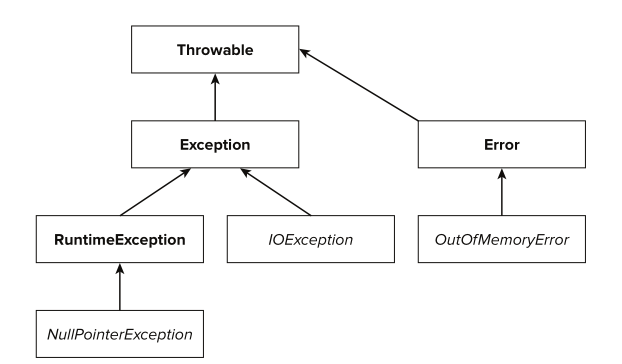
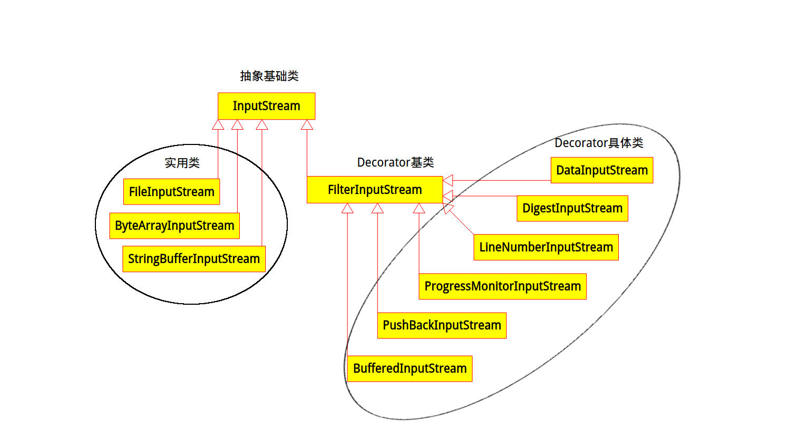

##获取JVM版本是32还是64
**可以检查某些系统属性如 `sun.arch.data.model` 或 `os.arch` 来获取该信息**
 即通过系统属性获取`System.getProperties()`
##switch case
`switch`支持`byte`,`short`,`int`,`boolean`,`char`,从1.7开始支持`String`,但这仅仅是一个语法糖。
内部实现在 switch 中使用字符串的 hashcode.但不支持`long`.
##精度问题
```java
public void testMulti() {
		System.out.println(3 * 0.1 == 0.3);// false:0.30000000000000004!=0.3,精度问题
	}
```
##一个+运算符
```java
public static void main(String[] args) {
		byte a = 127;
		byte b = 127;
		b = a + b; // error : cannot convert from int to byte
		b += a; // ok:+= 隐式的将加操作的结果类型强制转换为持有结果的类型
	}
```
##异常的分类
所有异常都是Throwable的子类，根据使用类别分为Exception和Error，Error是由于系统问题造成的，如内存空间不足等，而Exception是具体的异常的父类，根据编译器和运行期分为受检查异常和运行时异常，具体的集成结构图如下:

##代理模式和装饰模式的区别
两者是相似，但是有些细微的区别，主要是方法粒度不一样，装饰模式一般只是对特定行为方法增加额外职责；而代理模式则是所有方法增加新职责，而且这个新职责是一个方面或一系列的，并且装饰模式可以有装饰链。
其中java `IO`处理用到了装饰器模式,具体的层次结构如下图

##i++,i=i++
针对为什么`int i=1;i=i++;`后`i==1`，有疑惑，以下是相关字节码，释疑解惑啊.
`i++`对应bytecode
```
0: iconst_1       #将int型常量1push到操作数栈，当前栈顶的值为1 
1: istore_0       #pop操作数栈顶值1到局部变量表，赋给i值为1
2: iinc          0, 1  #自增指令，将局部变量的值加1，执行完成后，该变量值为2
5: return        
```
`i=i++`对应bytecode
```
0: iconst_1       #将int型常量1push到操作数栈，当前栈顶的值为1 
1: istore_0       #pop操作数栈顶值1到局部变量表，赋给i值为1
2: iload_0        #将局部变量表i的值push到操作数栈顶，，当前栈顶的值为1
3: iinc          0, 1 #自增指令，将局部变量的值加1，执行完成后，该变量值为2
6: istore_0       #pop操作数栈顶值1到局部变量表，赋给i值为1
7: return  
```
##常量池的变化
JDK1.7的新变化，将`constant pool`从`pemgen`挪到了`heap`，对于`intern`操作首先判断对中有没有该常量的引用，如果没有，则直接此对象就成为常量，可通过以下代码查看。
```java
public static void testForJDK17() {
		String a = "e";
		String b="f";
		String c=a+b;
		String d=a+b;
		System.out.println(c==c.intern());//true
		System.out.println(d==d.intern());//false
		System.out.println(c==d.intern());//true
	}
```
 以下是具体描述
 >Area: HotSpot
 >
 >Synopsis: In JDK 7, interned strings are no longer allocated in the permanent generation of the Java heap, but are instead   allocated in the main part of the Java heap (known as the young and old generations), along with the other objects created by the application. This change will result in more data residing in the main Java heap, and less data in the permanent generation, and thus may require heap sizes to be adjusted. Most applications will see only relatively small differences in heap usage due to this change, but larger applications that load many classes or make heavy use of the String.intern() method will see more significant differences.

##路径获取
```java
        /**
		 * this.getClass().getResource(""):当前类所在目录
		 */
		System.out.println(this.getClass().getResource("")); 
		/**
		 * this.getClass().getResource("/"):classpath所在目录
		 */
		System.out.println(this.getClass().getResource("/"));
	    /**
	     * this.getClass().getClassLoader().getSystemResource(""):classpath所在目录
	     */
		System.out.println(this.getClass().getClassLoader().getSystemResource(""));
```
##关于类加载过程的一个比较有特点的例子
```java
public class StaticTest
{
    public static void main(String[] args)
    {
        staticFunction();
    }
 
    static StaticTest st = new StaticTest();
 
    static
    {
        System.out.println("1");
    }
 
    {
        System.out.println("2");
    }
 
    StaticTest()
    {
        System.out.println("3");
        System.out.println("a="+a+",b="+b);
    }
 
    public static void staticFunction(){
        System.out.println("4");
    }
 
    int a=110;
    static int b =112;
}
```
***
```
2
3
a=110,b=0
1
4
```

## `bridge synthetic`方法

在这次自己写一个类`spring`解析注解，以进一步熟悉反射的时候在`method`的方法里看到了`bridge synthetic`方法:

```java
    public boolean isBridge() {
        return (getModifiers() & Modifier.BRIDGE) != 0;
    }
    public boolean isSynthetic() {
        return Modifier.isSynthetic(getModifiers());
    }
```

所以就研究了一把，原来这种情况是编译器为我们生成的，主要是编译器对以下的处理：

1. 具体类型继承自一个泛型类，同时被继承的泛型类包含了泛型方法，由于类型擦除的原因编译器为具体类型生成了`bridge synthetic`方法，如下代码实现：

   ```java
   abstract class A<T> {
       public abstract T method1(T arg);
       public abstract T method2();
   }
    
   class B extends A<String> {

   	@Override
   	public String method1(String arg) {
   		// TODO Auto-generated method stub
   		return null;
   	}

   	@Override
   	public String method2() {
   		// TODO Auto-generated method stub
   		return null;
   	}
   }
   ```

   由于java的泛型在编译时类型擦除，A类的泛型会被替换为Object，而B类是String类型，这是两个不同的方法，不能标示为对抽象方法的重写，所以编译器在编译时生成了桥接方法以将这种重写关联，具体的字节码如下：

   ```java
   A.class

   abstract class com.wyp.A {

    public abstract java.lang.Object method1(java.lang.Object arg0);

    public abstract java.lang.Object method2();

   }

   B.class

   class com.wyp.B extends com.wyp.A {

    public java.lang.String method1(java.lang.String arg);

       0 aload_1 [arg]

       1 areturn

    public java.lang.String method2();

       0 ldc <String "abc"> [20]

       2 areturn

    public bridge synthetic java.lang.Object method2();

       0 aload_0 [this]

       1 invokevirtual com.wyp.B.method2() : java.lang.String [23]

       4 areturn

     public bridge synthetic java.lang.Object method1(java.lang.Object arg0);

       0 aload_0 [this]

       1 aload_1 [arg0]

       2 checkcast java.lang.String [26]

       5 invokevirtual com.wyp.B.method1(java.lang.String) : java.lang.String [28]

       8 areturn

   }
   ```

   可见B字节码中生成了桥接方法`public bridge synthetic java.lang.Object method1(java.lang.Object arg0)`,并且其内部使用的是该类真实的`com.wyp.B.method1(java.lang.String)`方法。

2. 第二种是子类实现了父类的方法，但子类方法返回值是父类相应方法返回值的类型或其子类型，例子如下：

   ```java
   class E {
      
   }
    
   class F extends E {
      
   }
    
   class X {
       public E getE() {
          return new E();
       }
   }
    
   class Y extends X {
       @Override
       public F getE() {
          return new F();
       }
   }
   ```

   Y的字节码如下：

   ```java
   class com.wyp.Y extends com.wyp.X {

     public com.wyp.F getE();

       0 new com.wyp.F [16]

       3 dup

       4 invokespecial com.wyp.F() [18]

       7 areturn

    public bridge synthetic com.wyp.E getE();

       0 aload_0 [this]

       1 invokevirtual com.wyp.Y.getE() : com.wyp.F [20]

       4 areturn

   }
   ```

   可见编译器为子类生成了一个`bridge synthetic`方法`public bridge synthetic com.wyp.E getE()`,其内部调用的是该类自己实现的`com.wyp.F getE()`.

## 加密后乱码的问题

在项目做密码加密时，对加密后的`byte[]`通过`new String(byte[],charset)`的形式发现都是乱码，最后分析了下原因如下：

`MD5, SHA-256, SHA-512` 等等算法，它们是通过对`byte[]` 进行各种变换和运算，得到加密之后的`byte[]`，那么这个加密之后的 `byte[]` 结果显然 就不会符合任何一种的编码方案，比如 `utf-8, GBK`等，因为加密的过程是任意对`byte[]`进行运算的。所以你用任何一种编码方案来解码 加密之后的 `byte[]` 结果，得到的都会是乱码。

一般的实现思路是将每一个字节做16进制处理。

## 针对`mybatis`批量`updte mysql`的问题

对于批量update操作，由于每条sql以`;`分割，执行时会报错

```
com.mysql.jdbc.exceptions.jdbc4.MySQLSyntaxErrorException: You have an error in your SQL syntax; check the manual that corresponds to your MySQL server version for the right syntax to use near 'select 'world'' at line 1
	at sun.reflect.NativeConstructorAccessorImpl.newInstance0(Native Method)
	at sun.reflect.NativeConstructorAccessorImpl.newInstance(NativeConstructorAccessorImpl.java:57)
```

若一个sql中通过分号分割(或包含)了多个独立sql的话,默认就会报上面的错误，当若显式设置allowMultiQueries为true的话,就可以正常执行不会报错.如下所示:

```xml
jdbc:mysql://localhost:3306?allowMultiQueries=true
```

mysql官方解释称：

>**allowMultiQueries**
>
>Allow the use of ';' to delimit multiple queries during one statement (true/false), defaults to 'false', and does not affect the addBatch() and executeBatch() methods, which instead rely on rewriteBatchStatements.
>Default: false
>Since version: 3.1.1

##关于mysql中文乱码的问题
 很巧，刚解决完上面的问题，又遇到了这个问题，看来技术提升过程就是不停解决问题的过程
 先来了解一下这个问题的背景：使用`spring boot+jpa+mysql`开发时，写入的中文是乱码。
 解决过程大概如下：
1.  我先查看了数据库字符集信息：

    ```mysql
    SHOW VARIABLES LIKE 'char%';
    ```

    除了其他的，`character_set_server`的字符集为`latin`.

    所以设置`character_set_server`的字符集，如下：

    ```mysql
    SET GLOBAL character_set_server = utf8;
    ```

    但是不起作用哈。

2.  配置`my.ini`文件

    既然上述方法不管用，还得从根上解决问题，所以就改`my.ini`文件，如下：

    ```ini
    [mysqld]
    collation-server = utf8_unicode_ci
    init-connect='SET NAMES utf8'
    character-set-server = utf8
    ```

    再去查字符集信息，`SHOW VARIABLES LIKE 'char%';`，`character_set_server`的字符集以变为`utf8`.


