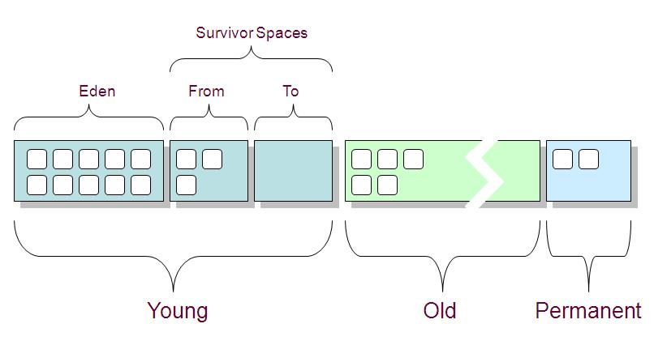

​    一年不管是读书还是练习，还是看各种博客，反正是学到了很多东西。从JVM的内存布局、gc、classloader、JIT、内存模型、优化调整到java的并发处理、排序算法的整理、java一些源码的分析，到个人github的使用和git的运用，再到数据库的一些优化，进入到mysql的一些原理初步了解，再到nosql的了解，如redis，了解了一些概念，组件化和微服务、虚拟化基本知识、docker的管理和玩耍,还有看了余华大大的几本小说，感悟了人生，总之收获颇多.

## JVM

java虚拟机作为真正运行java系统以及处理class文件的一个平台，在java学习中(当然不止是java，该虚拟机已经大量的被其他语言所使用)是至关重要的，深入的了解它，不管是编码实现，解决疑难杂症，还是技术圈的相互寒暄都是很有用处的。从以下几个方面概述下今年都得到了什么。

### 内存布局

1.  PC(程序计数器),存放当前运行指令偏移量的一块内存，是线程独享的.
2.  stack(栈)，这玩意也是线程独享的，每条线程运行时会为其分配一个内存栈，栈中存放的数据片(这里暂且叫片吧)叫栈帧，栈帧包括本地变量表，操作数栈，返回信息表，符号引用等信息。线程每进入一个方法会创建一个栈帧置于栈顶，执行完会出栈.
    * 本地变量表，操作数栈，返回信息表，符号引用在编译时确定的，只不过在运行时将符号引用转为直接引用。
    * 本地变量表的存储单元为slot(32字节),除了double，long占用两个slot，其他都是一个slot，其中实例方法的第一个slot存放的是this.
    * 本地变量表，操作数栈大小在编译时就能确定，所以在运行时，分配多大的内存是固定的.
3.  heap(堆),这块是空间最大的(基本上是)，是线程共享的,所有对象实例都存在这个地方(说到这里，插下嘴，栈中slot(非基本类型)在运行时存放的对象实例的引用，即在堆中的内存地址).
    * 对象实例是存储对象数据的真正内存区域结构,由对象头和实例数据组成.
        * 对象头包括两部分信息，前32字节存储的是对象的锁，gc等信息，后一部分存储的对象类型在方法区中标识该对象类型的地址引用.如果是数组类型的，还需要在头中存放长度信息。
    * 在jdk1.7开始，原本放在方法区中的常量池移到了该区域。
4.  方法区. 方法区是线程共享的，存放的是类的信息，类加载时将类信息存放到该区域.还存放一些常量信息。
    * 常量池是方法区的一部分，存放了一些运行时不变的信息，在类加载后存放类的信息(常静态量，属性、方法相关信息)。
    * jdk1.6之前在方法区有`pergen mem`作为常量池常量。

### GC

GC，即垃圾回收，主要针对的是堆区。由于大多数对象是使用完就无用，会被回收的，所以依据次规律JVM将内存又分代存储,分为年轻代、老年代、持久代。年轻代和老年代在堆区，持久代在方法区.



1. 对象优先分配在年轻代，年轻代采用停止复制算法进行内存的回收。
   * 年轻代又分为`Eden`，`surivor from`,`surivor  to`三块区间.其中默认大小Eden/surivor=8/1.
   * 每次新生代中可用的内存空间为整个新生代容量的90%，有10%的内存是被浪费的。
   * 每一次gc操作会将Eden去存活的对象和from存活的对象复制到to区。
   * 由于采用的复制算法，所以不会产生内存碎片。
   * 由于采用停止复制算法，所以在gc时，JVM会有暂时的停顿，即`stop the world`。
2. 年轻代存储不了的对象，超过某一阈值的大对象，在年轻代from-to一定次数还存活的对象等会在老年代存储,老年代采取的是标记清除算法。
   * 标记清除会产生内存碎片，当然有些gc算法会有压缩机制。
   * JDK1.7以后常量池在此区域。
3. 持久代存储的是类信息，静态常量。

**GC的回收是通过`可达性`判断来做处理的** ，可达性俗称是从`GC ROOTS`往下遍历看是否有路径到达该对象，如果有，则为可达，否则不可达.

1. `GC ROOTS`主要从一些几个点出发：
   * 线程栈帧的本地变量表
   * 类静态变量的引用
   * 线程所属变量
   * 类加载时的一系列引用
   * JNL 本地和全局参数
2. 还有一种判断方式交计数器，但此种如果牵扯到相互引用，即使别的地方没有对此的引用也不会回收。

**GC回收的时机：** 

1. 对象优先在Eden中分配，当Eden中没有足够空间时，虚拟机将发生一次Minor GC，因为Java大多数对象都是朝生夕灭，所以Minor GC非常频繁，而且速度也很快
2. Full GC，发生在老年代的GC，当老年代没有足够的空间时即发生Full GC，发生Full GC一般都会有一次Minor GC。
3. 发生Minor GC时，虚拟机会检测之前每次晋升到老年代的平均大小是否大于老年代的剩余空间大小，如果大于，则进行一次Full GC，如果小于，则查看HandlePromotionFailure设置是否允许担保失败，如果允许，那只会进行一次Minor GC，如果不允许，则改为进行一次Full GC。

**参数设置**

* -xmn 年轻代大小
* -xms 最小堆
* -xmx 最大堆
* -verbose:gc 检测内存gc信息

**`System.gc()`**

 其是通知JVM需要进行垃圾回收了，但是至于什么时候，这个是有JVM决定的。

 尽量少用，会对JVM的gc正常造成干扰。

**`finalize()`**

`finalize`是`Object`类的保护型方法，任何类都可以重写它，在回收该类的实例时，会调用此方法，可以在此方法中将此实例挂载到别的地方，以达到对象`复活`.

#### 安全点和安全区

为了支持准确枚举，JIT编译器需要做一些额外的工作，因为只有JIT准确地知道栈帧信息和寄存器上下文。 当JIT编译一个方法的时候， 对于每一个指令， 它都保存根引用信息，以防执行阻塞在那个指令上。

但是对每一个指令都保存那些信息太昂贵了。 它需要大量空间保存那些信息。 这是不必要的，因为 **只有一小部分指令有机会在实际执行时阻塞。 JIT只需要保存那部分指令的信息就够了-- 他们就把叫做安全点。安全点意味着对应根枚举来说，在该点阻塞是安全的**。

​        **安全区域是其中引用不会改变的一段代码片段，那么在其中任一点进行根枚举都是安全的。 换句话说，安全区域是安全点的一个很大的扩展。**

　　在安全点的设计中，如果GC触发事件发生了，执行函数通过轮询进行响应。它通过设置一个准备好的标志（ready flag）来响应。 那么GC就可以进行根枚举了。这是一个握手协议。

　　安全区域也遵循这个协议。执行函数在进入安全区域时设置ready flag。在它离开安全区域以前，它先检查GC是否完成了枚举（或者收集），并且不再需要执行函数呆在阻塞状态。如果是真的，它就向前执行，离开安全区域； 否则，它就像安全点一样阻塞他自己。

> [GC 安全点 和安全区域](http://www.cnblogs.com/ridox/p/3646381.html)

### 类加载

​      Class文件由类装载器装载后，在JVM中将形成一份描述Class结构的元信息对象，通过该元信息对象可以获知Class的结构信息：如构造函数，属性和方法等，Java允许用户借由这个Class相关的元信息对象间接调用Class对象的功能。

      虚拟机把描述类的数据从class文件加载到内存，并对数据进行校验，转换解析和初始化，最终形成可以被虚拟机直接使用的Java类型，这就是虚拟机的类加载机制。

#### 加载机制

 (1) 装载：查找和导入Class文件；

 (2) 链接：把类的二进制数据合并到JRE中；

        (a)校验：检查载入Class文件数据的正确性；

        (b)准备：给类的静态变量分配存储空间；

        (c)解析：将符号引用转成直接引用；

 (3) 初始化：对类的静态变量，静态代码块执行初始化操作

装载-----》链接-----》初始化

链接又分为三步：校验--》准备--》解析

1. 装载：查找和导入Class文件，并在此阶段创建一个对应该class文件的`Class`实例
2. 链接：把类的二进制数据合并到JRE中
   * 校验：检查载入Class文件数据的正确性
     * 检验class字节流的正确性，即魔法数是不是`0xCAFEBB`,jre版本正确与否
     * 检验一些符号引用的正确性
   * 准备：给类的静态变量分配存储空间
     * 此时会为静态变量赋零值，对于`constant value`会直接赋变量值.
   * 解析：将符号引用转成直接引用
3. 初始化：对类的静态变量，静态代码块执行初始化操作
   * 此处编译器执行`<clinic>`初始化方法，此方法按照变量声明初始化、静态代码块编码的顺序组合.
   * 静态变量可以在声明之前初始化，但是不能作为引用.
   * 这里的初始化是类的初始化，不是对象的实例化，对象实例化需要执行`<init>`方法.


#### 双亲委派模式

`Bootstrap ClassLoader`<---`Extension Classloader`<---`Application Classloader`<---`Custom ClassLoader`

通过指定父类加载器，当类加载器加载类时，会优先查找父类加载器进行加载，如果父类加载器没有加载或加载不了，则使用该类加载器进行加载，下面是一些代码。

```java
loadClass(String name, Boolean resolve) throws ClassNotFoundException{    
   //首先检查请求的类是否已经被加载过    
   Class c = findLoadedClass(name);    
   if(c == null){    
     try{    
        if(parent != null){//委派父类加载器加载    
          c = parent.loadClass(name, false);    
        }else{//委派启动类加载器加载    
        c = findBootstrapClassOrNull(name);     
        }    
     }catch(ClassNotFoundException e){    
         //父类加载器无法完成类加载请求    
     }    
   if(c == null){//本身类加载器进行类加载    
       c = findClass(name);    
      }    
    }    
 if(resolve){    
    resolveClass(c);    
}    
return c;    
} 
```

**如下定义的类加载器，其父类加载器结果**如下.

*注意：`Ext`的父类加载器为`null`，标识为根类加载器`Bootstrap`*

```java
public HowswapCL(String basedir, String[] clazns) {
		super(); // 指定系统类加载器为该classloader父类加载器
		this.basedir = basedir;
		dynaclazns = new HashSet();
		loadClassByMe(clazns);
	}
```

```java
HowswapCL@6c908f05
sun.misc.Launcher$AppClassLoader@5b941dc9
sun.misc.Launcher$ExtClassLoader@592fa617
null
```

这种委派模式保证了java基础类库或者一些基本框架只被加载一次，保证资源的共享，不浪费资源。

#### 关于自定义类加载器

自定义类加载器需要继承`ClassLoader`,通过重写`loadClass(String name)`完成类的加载动作，代码如上。

一些方法描述：

* loadClass(String name,Boolean resolve)  加载本地或网络的class文件或字节流.
* Class<?> defineClass(String name, byte[] b, int off, int len) 定义一个对应该字节码流的Class对象.
* resolveClass(Class<?> c)  类加载过程的链接过程(当然看了好多，loadClass的resolve都为false，不是加载都需要链接的过程么，不知道为什么？还没找着相关资料)

#### 类的卸载

当类使用完后想卸载，需要一些条件：

1. 该类衍生的对象不再有引用。
2. 该类对应的Class不再有引用。
3. 加载该类的类加载器不再有引用

这样衍生的问题是，用系统类加载器加载的类在JVM生命周期中是不会卸载的。所以支持热部署的操作需要自己写类加载器来完成，以达到类加载器引用的不可达.

```java
public static void main(String[] args) throws Exception {
		// 每次都创建出一个新的类加载器
		HowswapCL cl = new HowswapCL("E:/workhome/cl/bin/", new String[] {          "Foo" });
		Class cls = cl.loadClass("Foo");
		Object foo = cls.newInstance();
		
		Method m = foo.getClass().getMethod("sayHello", new Class[] {});
		m.invoke(foo, new Object[] {});
		//卸载class
		m=null;
		foo=null;
		
		cls=null;
		cl = null;
		 // 执行一次gc垃圾回收  
        System.gc();
        System.out.println("GC over");
}
```

#### 类加载器衍生的问题

1. 类实例判定的问题---`instanceof`

   只有被同一类加载器加载的类所衍生的对象实例才能判定相等或`instanceof`的判定，不被同一类加载器加载类实例的`instanceof`始终为false，类加载是划分区域的一个标准。这也提供了一种隔离手段。

2. 加载时机

   * `new` ,`getStatic`,`putStatic`操作。
   * 子类的加载引起的父类加载。
   * 反射。
   * 元素为对象的数组`new`不会引起元素类的加载。
   * 由于类的静态元素放在方法区，所以对静态元素的使用只会触发该静态元素所属类的加载。


### `JIT`

​     jvm在执行字节码时，是通过解释器与编译器配合工作输出结果的.解释器将字节码解释成平台相关指令，执行后输出结果。编译器对于执行频繁的字节码直接编译成平台相关指令code，并缓存在内存中，下次执行时直接调用。如果从严格的角度讲HotSpot VM没有使用严格的“JIT编译”,而其JIT编译是自适应编译。

*JIT编译与自适应编译都属于“动态编译”（dynamic compilation），或者叫“运行时编译”的范畴。特点是在程序运行的时候进行编译，而不是在程序开始运行之前就完成了编译；后者也叫做“静态编译”（static compilation）或者AOT编译（ahead-of-time compilation）。*

JIT编译与自适应编译相比：

* 前者的编译时机比后者早：第一次执行之前 vs 已经被执行过若干次
* 前者编译的代码比后者多：所有执行过的代码 vs 一部分代码

HotSpot VM是一个典型的自适应动态编译系统，使用解释器或Client Compiler（C1）来实现初始执行和profile的收集，然后把profile信息交给Server Compiler（C2）做优化编译。

> [一个讲解JVM的视频](http://www.tudou.com/programs/view/dBs7baKzvxU/)

综上，Hotspot jvm在运行字节码时是通过解释器与JIT配合的方式来完成字节码的执行的，在系统启动或者字节码刚加载后，通过解释器解释执行，并通过开启profile来收集字节码(这里是一个方法或者循环等的字节码)的使用频率，如果使用频率超过一定的阈值，则执行JIT优化(*注意：即使是循环其优化也是按方法为单位进行优化的*)，下次调用此字节码时，直接调用JIT优化后缓存在内存中的指令码。

### 内存模型

​     计算机存储模型是cpu每次都操作缓存里的数据，该缓存的数据都是通过内存中而来，而java也有自己的内存模型，如下图，线程每次操作的数据都是工作内存中数据，工作内存中数据是主内存中数据的拷贝(当然一个100M的大对象不可能全部拷贝，有一种策略，还需进一步学习),每次完成后再写入到主内存。


*如果硬要与传统堆栈模型做类比的话，主内存相当于堆，工作内存相当于栈，并且牵扯到这种模型的数据一般不包括局部变量，调用方法传入的参数，当然对于引用类型，只能保证栈帧中的引用没有线程同步的影响.*

这种内存模型引出的问题是数据一致性问题，即线程修改变量引起的变量值的不同步。

为了解决多线程下数据一致性问题，JMM有一些特殊语法处理，来调用底层指令处理数据的同步以保证一致性.

1. volatile

   * 能保证数据的一致性，但不能保证数据的原子操作
   * 能一定程度的防止指令重排序(volatile变量相关操作指令之前的操作不会在该指令以下执行)
   * 当其中一线程修改了`volatile`修饰的变量并从工作内存写入到主内存后，或通知其他有引用此变量的线程的工作内存此变量无效，下次使用时会重新从主内存加载到工作内存。

2. synchronized

   * 基于方法和代码块的同步措施，能保证这个方法或代码块某一时刻只有一个线程在操作。
      要点：
   1. 对于实例方法的同步是通过acc_flags标志来实现的.在实例对象头部存放了对象的gc,同步监视器，如果是数组的话有长度等信息.如果方法设置了同步标志
        会去判断同步监视器的使用情况，来决定是否能够占有同步锁.
   2. 对于同步代码快，会在class文件有`monitorenter`和`monitorexit`字节码标识对实例对象的同步占有情况，他俩是一对的.
   3. 自旋锁、锁优化、锁消除等

3. ReentrantLock

   * 与`synchronized`有同样的功能，但是这种方式有可重入性。
   * 重量级操作，比较耗时。

4. final

   * final只是不能重新指向变量的引用，但不能保证该引用所对应的实例有其他的引用。
   * 如果在一个线程构造了一个不可变对象之后（对象仅包含final字段），你希望保证这个对象被其他线程正确的查看，你仍然需要使用同步才行。例如，没有其他的方式可以保证不可变对象的引用将被第二个线程看到。使用final字段的程序应该仔细的调试，这需要深入而且仔细的理解并发在你的代码中是如何被管理的。


### 优化调整

其实这里的优化调整概念比较广，不管是针对JVM，java code还是数据库相关，都是一个长期的实践加琢磨的过程。

1. JVM通过调整参数或者一些检测工具来查看JVM的使用情况，预见将要出现的问题或者解决已经出现的问题。
   * jps，jstack，jstat，jhat这些命令监控工具
   * jconsole，visualVm这些图形化工具
   * 来解决内存溢出，栈溢出等运行时error
2. java code，在编码时注意一些容易引起上述问题的操作，比如资源及时释放，锁的同步释放问题
3. 数据库优化，避免大量的循环单条操作数据库，尽量批量操作减少多次网络传输。在sql处理中，尽量采用预编译的方式，减少sql的硬解析。

## 并发处理

​     这次算是对java提供的高并发处理工具有了进一步的了解。不管是线程池还是基于原子操作的工具类，还是一些为简化操作而提供的类似`Fork/join`工具等。

1. 线程池

   * 通过`Executors`提供的静态方法创建多种类型的线程池

     * `newFixedThreadPool `     固定线程数
     * `newSingleThreadExecutor`   固定线程数为1
     * `newCachedThreadPool`    可根据需要创建新线程，线程可重用，最大为`Integer.MAX_VALUE`
     * `newScheduledThreadPool`  创建一个可以调度任务的线程池

   * 线程池的特点

     * 首先如果有新任务会创建新线程，直到数量到达`corePoolSize`会将新的任务缓存到任务队列列面。
     * 如果`corePoolSize`这些线程都在使用，并且任务队列已满，则会继续创建线程直到`maxPoolSize`，当到达此数量还解决不了任务队列满的问题，会抛出`RejectedExecutionHandler`，当然这里的拒绝执行异常由自己实现。
     * `corePoolSize`以内的线程会一直存活，当新任务进入时，且没有达到`corePoolSize`时，会优先选择创建新的线程。

   * 任务处理

     * `submit()`  可处理一般的`Runnable`，也可处理有返回值的任务`callable`。
     * `shutdown()`  会处理已经提交的任务，但是池不会接受新的任务提交。
     * `shutdownNow()` 会尝试着消除所有任务。

2. 并发框架

   * `CountDownLatch`
     * `CountDownLatch`能使所有线程等待，直到其他线程结束操作，通过`await`做等待操作，直到`countDown`操作使`Latch`为0，则执行后续的操作.
     * 通过`CountDownLatch(int count)`新建一个实例，并需要`count`次`CountDown`  才能唤醒等待的线程。
     * `countDown()`将`countDown`次数减一。
     * `await()`等待`countDown`次数为0才被唤醒。
   * `CyclicBarrier`
     * `CyclicBarrier`是回环栅栏。
     * 通过`new CyclicBarrier(parties, barrierAction)`生成一个实例，`parties`是所有等待被唤醒需要的线程数,`barrierAction`是一个所有线程被唤醒后需要执行的栅栏动作。
     * 通过`await`操作等待在`barrier`。
     * 当所有线程都到达`barrier`时，会推选任一线程执行`barrierAction`，并且会执行后续的操作。
     * `CyclicBarrier`可重复使用。
   * `Exchanger`
     * `Exchanger`主要用来作为两线程交换数据使用。
     * 通过`new Exchanger()`实例化一个交换器。
     * 当线程调用`exchange`操作时，线程进入阻塞状，当其他线程也调用时，将数据交换，执行后续操作。
   * `Fork/Join`
     * `Fork/Join`也叫分而治之，通过将大任务分成多个小任务，最后再合成，利用并发的特性执行，效率较高。
     * `Fork/Join`通过使用`ForkJoinTask`和`ForkJoinPool`来完成.
       * 其中`ForkJoinTask`提供了以下两个子类：
         * RecursiveAction：用于没有返回结果的任务。
         * RecursiveTask ：用于有返回结果的任务。
     * `fork()`来分解,`join()`来合成。
     * 这个工具在`1.7`才加进来的。
   * `Semaphore`
     * `Semaphore`即信号量，通过信号量，控制对公共资源的访问。
     * 通过`acquire`等待资源的获取，`release`释放资源。
     * 和`notify/await`功能类似，只是封装了对临界资源的状态判断。

3. 普通线程

   * 线程中断
     * 由于对线程停止有些暴力，这里通过线程中断的方式通知线程你应该停下了，至于怎么处理，需要线程自己做处理。
     * 中断方法
       * `interrupt()`通知线程需要中断。
       * `static boolean interrupted()`用于判断线程是否收到了中断信号，并且清除这个中断信号。
       * `isInterrupted()`判断线程是否被中断，即是否收到中断信号。
       * 例外：
         * `Thread.sleep()`,`Thread.await()`时接收到中断信号，会清除这个中断信号，即线程下次认为自己没有被中断。
   * `临界资源的通知/唤醒`
     * 通过`object.wait()`,`object.notify()`实现线程的通知唤醒操作。
     * `notify`,`wait`是针对对象级的操作，所以在调用这些方法时，必须使当前线程成为对象监视器的所有者。如果没有同步操作，则会报如下错误，指明当前线程不是对象监视器的所有者。

4. 原子类工具

   * `Atomic**`提供了一些对基本类型对象级的原子操作功能。
     * `compareAndSet(int expect, int update)`原子的操作。
   * 为了解决`ABA`问题，通过`AtomicStampedReference`加修改标记戳的方式来解决此问题。

##算法

通过在`leetcode`上做题，以及在`实验楼上`做题，并且温习了基本的排序算法，比较锻炼脑子，慢慢迟钝的小脑袋慢慢开始退锈了，哈哈。

**第一步从排序算法**开始：

1. 选择排序：每次选择一个最值，直接和目标位数交换。

2. 插入排序：浪费空间和时间，每次将源序列中的元素和目标序列中的每一个元素做比较。

3. 快排：快排以一个元素作为分界点，利用分而治之的思想，通过递归各自排好序再合成的思想实现。

4. 归并排序：思想也是分而治之的思想，和快排有些类似。

5. 冒泡排序：通过相邻元素间比较，并移动大的元素来实现，如果正好有序，则只需要一次。

6. 在JDK的源码中，由于`Collection`最终是以数组的形成呈现的，其排序是通过`Arrays.sort(Object[])`来完成的。

   ```java
   public static void sort(Object[] a) {
           if (LegacyMergeSort.userRequested)
               legacyMergeSort(a);
           else
               ComparableTimSort.sort(a);
       }
   ```

   *通过上面`legacyMergeSort`是传统的归并排序，而在`1.7`以后使用的是`ComparableTimSort`,其内部实现是`Timsort`,这个还需进一步研究。*

**第二步当然是查找了**：

1. 顺序查找：浪费时间。
2. 二分查找：由于这种适合有序序列。
3. 树结构：通过将各元素分解在树的各节点上，快速查找。

**第三步是leetcode的练习了**：

通过练习[算法题](https://github.com/earthlyfisher/Algorithm),对一些技巧，递归的运用有了一定的认识，但是不得不吐槽的是。`leetcode`的测试用例有的不全，有的有问题，做了这么多题，印象最深的是正则算法的那道题(`RegularExpressionMatching`)，技巧运用相当的妙啊。

以后还是要坚持，脑子还是得磨磨啊！

## 源码分析

### 基本数据类型的引用类型

 像`Byte`,`Integer`,`Long`这些类型有`cache`机制，也叫享元模式，将`-128-127`之间的数据缓存常量池中，像下面这种:

```java
Integer a=1;//Integer a=Integer.valueOf(1);
```

其实用到了装箱，装箱采用了享元模式，源代码如下：

```java
 public static Integer valueOf(int i) {
        assert IntegerCache.high >= 127;
        if (i >= IntegerCache.low && i <= IntegerCache.high)
            return IntegerCache.cache[i + (-IntegerCache.low)];
        return new Integer(i);
    }
```

在涉及到运算操作的时候会进行拆箱操作，如下：

```java
Integer a=Integer.valueOf(1);
Integer b=1;
Long c=2L;
System.out.println(a+b==c);//
```

上面的`a+b==c`相当于`a.intValue()+b.intValue()==c.longValue()`。

其他的类似。

### `String`

`String`算是用的最多的一个引用类型了，是不可变类型的一个代表，由于其不可变特性，所以对它的修改是线程安全的。内部是通过`final char[]`数组实现的。

1. `hashCode()`

   * 哈希码通过对每个字符的计算得出，其算法为`s0*31^(length-1)+s1*31^(length-2)+...+s(n-1)`得出，当然这是在初始`hash`为0的情况下。

   * 哈希码主要用在字典表这种运用哈希桶的地方，来唯一确定一个哈希桶。

2. `substring(beginIndex, endIndex)`

     求子串其实和源`String`实例用的同一个`char[]`引用，只是新的实例重新指定了`offset`和`count`。这有一个问题是如果源串很大，求子串时，char数组引用占用的空间是不释放的。

   `split`内部使用的求子串的方法，所以类似，注意点吧。

3. `intern`

    `intern`是将字符串方法常量池的手段，其是一个`native`方法，判断常量池中有无该字符串值的串，有则指向这个引用，否则重新生成一个。

   * *`String s=new String("123")`*创建了几个对象？

     * a：至少在堆中创建一个对象，s的引用指向堆中的引用，另外一个对象会在常量池中判断有无`123`这个字符串，有则不创建，无则创建。

   * `1.7`之后，将常量池从从方法区移到了堆区，所以下面的代码在6和7执行会有差别：

     ```java
     String a="a";
     String b="b";
     String c=a+b;
     System.out.println(c==c.intern());//1.7 true
     ```

     ```java
     String a="a";
     String b="b";
     String c=a+b;
     System.out.println(c==c.intern());//1.6 false
     ```

###`Map`

`HashMap`是所有哈希字典存储的基础，通过哈希桶存储，利用`hashCode%桶数量`来分散的将字典元素存储在不同的链表上，即每一个桶的存储是通过单链表实现的。

默认的数量为16，负载因子为0.75，即最多存储12个元素后会发生扩容，扩容一般为原来容量的二倍。

**与`HashTable`的比较**：

1.    `HashTable`不允许key-value 为null,而`HashMap`则可以，由于`HashMap`对这种情况做了特殊处理，而`HashTable`通过null key做hash码的时候会报空指针。

      ```java
      //HashMap
      public V put(K key, V value) {
              if (table == EMPTY_TABLE) {
                  inflateTable(threshold);
              }
              if (key == null)
                  return putForNullKey(value);
        
        
         /**
      * Offloaded version of put for null keys
      */
      ```
       private V putForNullKey(V value) {
           for (Entry<K,V> e = table[0]; e != null; e = e.next) {
               if (e.key == null) {
                   V oldValue = e.value;
                   e.value = value;
                   e.recordAccess(this);
                   return oldValue;
               }
           }
           modCount++;
           addEntry(0, null, value, 0);//即hash码为0处理
           return null;
       }
   ```

   ```java
   //HashTable
   public synchronized V put(K key, V value) {
           // Make sure the value is not null
           if (value == null) {
               throw new NullPointerException();
           }

           // Makes sure the key is not already in the hashtable.
           Entry tab[] = table;
           int hash = hash(key);
     
     
   private int hash(Object k) {
           // hashSeed will be zero if alternative hashing is disabled.
           return hashSeed ^ k.hashCode();//这里key不能为null，否则空指针
       }
   ```

2. `HashTable`是线程安全的，由于所有操作都对字典数组做了同步处理，对这个优化做的最好的是通过分段锁实现的`ConcurrentHashMap`。

**HashSet**的实现

`HashSet`的内部是通过`HashMap`实现的，将`add`的元素作为`key`，每次`new`一个`Object`作为`value`，这样保证了唯一。

### `Spring`的`AOP`机制

`Spring`的`AOP`是通过代理模式实现的，对于实现了了接口的类，通过实现`InvocationHandler`与`Proxy`配合的方式创建代理类。并实现功能；而对于无接口实现的则通过`CGLIB`第三方框架实现以上属于动态代理，在运行时生成。

```java
public class DefaultAopProxyFactory implements AopProxyFactory, Serializable {

	@Override
	public AopProxy createAopProxy(AdvisedSupport config) throws AopConfigException {
		if (config.isOptimize() || config.isProxyTargetClass() || hasNoUserSuppliedProxyInterfaces(config)) {
			Class<?> targetClass = config.getTargetClass();
			if (targetClass == null) {
				throw new AopConfigException("TargetSource cannot determine target class: " +
						"Either an interface or a target is required for proxy creation.");
			}
			if (targetClass.isInterface() || Proxy.isProxyClass(targetClass)) {//如果是接口，则通过JDK代理
				return new JdkDynamicAopProxy(config);
			}
			return new ObjenesisCglibAopProxy(config);//否则使用Cglib
		}
		else {
			return new JdkDynamicAopProxy(config);
		}
	}
```

> 一道**印象深刻**的题，怎么对HashMap<Integer,Integer>的元素按value的大小排序，通过实现`Comparator`重写`compare`方法来完成。
>
> ```java
> public class Test {
> 	
> 	public static void main(String[] args) {
> 		HashMap<Integer,Integer> map=new HashMap<>();
> 		for(int i=0;i<10;i++){
> 			map.put(i, 10-i);
> 		}
> 		Set<Entry<Integer, Integer>> set=map.entrySet();
> 		for(Entry<Integer, Integer> entry:set){
> 			System.out.println(entry.getValue());
> 		}
> 		System.out.println("==================================");
> 		List<Entry<Integer,Integer>> list=new            ArrayList<Entry<Integer,Integer>>(set);
> 		Collections.sort(list, new HashMapComp());
> 		for(Entry<Integer, Integer> entry:list){
> 			System.out.println(entry.getValue());
> 		}
> 	}
> 	
> }
>
> class HashMapComp implements Comparator<Entry<Integer,Integer>>{
> 	@Override
> 	public int compare(Entry<Integer, Integer> o1, Entry<Integer, Integer> o2) {
> 		return o1.getValue().compareTo(o2.getValue());
> 	}
> } 
> ```

## 下半场

不知不觉已经放了这么多天，今天2016最后一天，有点时间正好把剩下的再总结下，说实话，今年过的相对容易，没有前两年那么忙，个人时间很多，促使自己看了很多书，学了很多习哈哈，^_^。

* `worker`模型

在重新整理并重构项目的任务处理模块时，接触到了`worker`模型，该模型不干扰主程序功能层次，通过将任务交给第三方工人(当然多任务的话,就是各包工头的概念,具体他将任务配发给线程池(多个工人),最终有具体的线程去执行)负责就ok啦，具体的执行和运作由Worker帮你完成（当然在同步串行性要求高的情况下这还有待商榷），但是就项目的一般处理或者更复杂的处理这是完全ok的。


上图是基本的实现思想。

* `tomcat`的运行机制

   说实话，这一块还需要花时间研究下，花了两天(当然加起来估计不到一上午)看了下结构，

  **初衷？**

  因为我当时做过一个小例子，针对` no web.xml `而实现web项目，但是一直有个疑惑，tomcat启动过程中在找不到web.xml文件的情况，怎么找到我自己实现的初始化器？

  **Answer**

  通过研究源码，知道是这么个过程：

  1. 在`classpath:/WEB-INF/lib/`下查找`jar`(在`/META-INF/services/`下有无文件名为`javax.servlet.ServletContainerInitializer`的文件，这是个约定吧)，如果有此文件，则解析此文件，将其字符串标识的类作为该Context的初始化器。
  2. 解析上面的Context的初始化器`@HandlesTypes`注解的values值，以标识该初始化器需要初始化那些类型(包括该类型的子类)。
  3. 在`classpath:/WEB-INF/classes/`下查找上面第二步values值所表示的类或者该类的子类，作为需要Set集合传入由该初始化器加载。
  4. 通过反射调用此初始化器的`onStartup(Set<Class<?>> webAppInitializerClasses, ServletContext servletContext)`启动。

  *上面这个过程在`Spring`的`spring-web`中已经实现:*

  ```java
  #/META-INF/services/javax.servlet.ServletContainerInitializer内容
  org.springframework.web.SpringServletContainerInitializer
    
  #org.springframework.web.SpringServletContainerInitializer内容
  @HandlesTypes(WebApplicationInitializer.class)
  public class SpringServletContainerInitializer implements ServletContainerInitializer {
    @Override
  	public void onStartup(Set<Class<?>> webAppInitializerClasses, ServletContext servletContext)
  			throws ServletException {
                
  			}
  }

  #我自己实现的WebApplicationInitializer
   public class DefaultConfigration implements WebApplicationInitializer {
  	@Override
  	public void onStartup(ServletContext container) throws ServletException {

  		// 配置Spring提供的字符编码过滤器
  		javax.servlet.FilterRegistration.Dynamic filter = container.addFilter("encoding",
  				new CharacterEncodingFilter());
  		// 配置过滤器的过滤路径
  		filter.addMappingForUrlPatterns(EnumSet.of(DispatcherType.REQUEST), true, "/");

  		// 基于注解配置的Spring容器上下文
  		AnnotationConfigWebApplicationContext rootContext = new AnnotationConfigWebApplicationContext();
  		// 注册Spring容器配置类
  		rootContext.register(AppConfig.class);
  		container.addListener(new ContextLoaderListener(rootContext));
  	}
  }
  ```

  上面使整个过程,通过自己实现初始化器，对`servlet`,`filter`,`listener`，`初始化上下文`等的加载有了进一步的概念。

  下面是一张tomcat的实现基本结构图：

  

  具体的实现，还需进一步研究，下面是链接：

  > [Tomcat 系统架构与设计模式，第 1 部分: 工作原理](http://www.ibm.com/developerworks/cn/java/j-lo-tomcat1/)


​     


