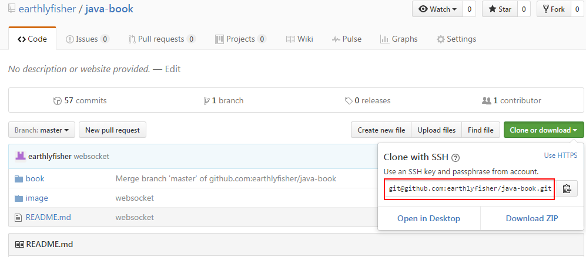

#往返过去与未来
##穿越到过去
当我们提交了若干版本，想回退到以前某一版本时，首先，Git必须知道当前版本是哪个版本，在Git中，用HEAD表示当前版本，也就是最新的提交3628164...882e1e0（当然这个id不一定一样），上一个版本就是HEAD^，上上一个版本就是HEAD^^，当然往上100个版本写100个^比较容易数不过来，所以写成HEAD~100。
以下是提交的版本信息：
```
$ git log --pretty=oneline
97ce1a41b9ea6192254da48c634263e38910c638 append
a00bd1c06b77755a57ddb52eecedf1b1b2e7d577 singleton
394cd290e2a9392b4b5ee669bfe2805b1c92277e websocket
79c063b10583a7072b703056ea157b54fc08ef81 Merge branch 'master' of github.com:earthlyfisher/java-book
ed915264579ee3a7060cc141b9b31d06fec562b1 websocket
```
*`--pretty=oneline`可以将log信息显示在一行*

返回到上一个版本：
```
$ git reset --hard HEAD^
HEAD is now at a00bd1c singleton
```
当然可以通过id的形式去回退，由于HEAD^的commit id为a00bd1c06b77...,所以可以通过下面方式:
```
git reset --hard HEAD^
HEAD is now at a00bd1c a00bd1c06b77
```
##穿越到未来
由于以上的回退操作使得我们通过log日志没法追踪前一次commit id，但是有办法的，可以通过`reflog`追踪操作日志:
```
$ git reflog
97ce1a4 HEAD@{0}: reset: moving to 97ce1a41
a00bd1c HEAD@{1}: reset: moving to HEAD^
97ce1a4 HEAD@{2}: commit: append
a00bd1c HEAD@{3}: commit: singleton
```
可以看到`append`这次操作`commit id`记录，所以可以通过
```
$ git reset --hard 97ce1a41
HEAD is now at 97ce1a4 append
```
穿越到未来
##summary
* `HEAD`指向的版本就是当前版本，因此，Git允许我们在版本的历史之间穿梭，使用命令`git reset --hard commit_id`
* 穿梭前，用`git log`可以查看提交历史，以便确定要回退到哪个版本
* 要重返未来，用`git reflog`查看命令历史，以便确定要回到未来的哪个版本

#撤销修改
当你更改了文件，但是过后又觉得有问题，想回到这次更改前的状态，可以通过
```
$ git checkout -- 13.txt
```
命令`git checkout -- readme.txt`意思就是，把`readme.txt`文件在工作区的修改全部撤销，这里有两种情况：

一种是`readme.txt`自修改后还没有被放到暂存区，现在，撤销修改就回到和版本库一模一样的状态；

一种是`readme.txt`已经添加到暂存区后，又作了修改，现在，撤销修改就回到添加到暂存区后的状态。

总之，就是让这个文件回到最近一次`git commit`或`git add`时的状态。

*`git checkout -- file`命令中的--很重要，没有--，就变成了“切换到另一个分支”的命令，我们在后面的分支管理中会再次遇到`git checkout`命令*

#远程仓库
##添加远程库
可以自己搭建git服务器，但是有个东西叫`github`,可以先在上面创建一个`repository`，下面是我创建的`repository`：



将本地库和远程库关联
```
$ git remote add origin git@github.com:earthlyfisher/java-book.git
```
添加后，远程库的名字就是origin，这是Git默认的叫法，也可以改成别的，但是origin这个名字一看就知道是远程库。

以上必须将`SSH Key公钥`添加到`github`账户列表中.

下一步，将工作区中的内容推送到远程仓库:
```
$ git push -u origin master
```
把本地库的内容推送到远程，用`git push`命令，实际上是把当前分支`master`推送到远程。

由于远程库是空的，我们第一次推送`master`分支时，加上了`-u`参数，`Git`不但会把本地的`master`分支内容推送的远程新的`master`分支，还会把本地的`master`分支和远程的`master`分支关联起来，在以后的推送或者拉取时就可以简化命令。

只要做完以上操作，在以后的操作中,只要本地作了提交，就可以通过命令：
```
$ git push origin master
```
##从远程库克隆
假如远程库已经有相关内容了，可以通过克隆的方式将远程库克隆到本地的工作区:
```
$ git clone git@github.com:earthlyfisher/java-book.git
```

**注意：**`Git`支持多种协议，包括`https`，但通过`ssh`支持的原生`git`协议速度最快。

#分支管理
##修改暂存
可以将当前的修改通过`git stash`储藏起来，在做其他的修改后，再回来处理:
暂存：
```
$ git stash
Saved working directory and index state WIP on dev: 97ce1a4 append
HEAD is now at 97ce1a4 append
```
暂存后当前分支就看不到变化了.

查看暂存区列表：
```
$ git stash list
stash@{0}: WIP on dev: 97ce1a4 append
stash@{1}: WIP on master: 97ce1a4 append
```
恢复暂存区数据:
```
$ git stash pop
On branch dev
Changes not staged for commit:
  (use "git add <file>..." to update what will be committed)
  (use "git checkout -- <file>..." to discard changes in working directory)

        modified:   13.txt
```
`git stash pop`恢复的同时把`stash`内容也删了.
##多人协作
一般在项目中需要`master`,`dev`,`bug`,`feature`分支作为基础的开发,各分支的管理如下：
* master分支是主分支，因此要时刻与远程同步；
* dev分支是开发分支，团队所有成员都需要在上面工作，所以也需要与远程同步；
* bug分支只用于在本地修复bug，就没必要推到远程了，除非老板要看看你每周到底修复了几个bug；
* feature分支是否推到远程，取决于你是否和你的小伙伴合作在上面开发