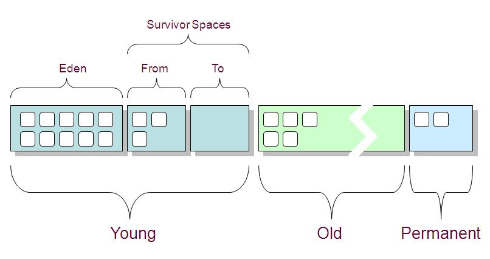
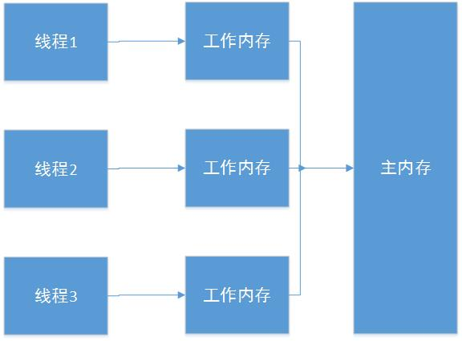

​    一年不管是读书还是练习，还是看各种博客，反正是学到了很多东西。从JVM的内存布局、gc、classloader、JIT、内存模型、优化调整到java的并发处理、排序算法的整理、java一些源码的分析，再到数据库的一些优化，进入到mysql的一些原理初步了解，再到nosql的了解，如redis，了解了一些概念，组件化和微服务、虚拟化基本知识、docker的管理和玩耍,还有看了余华大大的几本小说，感悟了人生.

# JVM

java虚拟机作为真正运行java系统以及处理class文件的一个平台，在java学习中(当然不止是java，该虚拟机已经大量的被其他语言所使用)是至关重要的，深入的了解它，不管是编码实现，解决疑难杂症，还是技术圈的相互寒暄都是很有用处的。从以下几个方面概述下今年都得到了什么。

## 内存布局

1.  PC(程序计数器),存放当前运行指令偏移量的一块内存，是线程独享的.
2.  stack(栈)，这玩意也是线程独享的，每条线程运行时会为其分配一个内存栈，栈中存放的数据片(这里暂且叫片吧)叫栈帧，栈帧包括本地变量表，操作数栈，返回信息表，符号引用等信息。线程每进入一个方法会创建一个栈帧置于栈顶，执行完会出栈.
    * 本地变量表，操作数栈，返回信息表，符号引用在编译时确定的，只不过在运行时将符号引用转为直接引用。
    * 本地变量表的存储单元为slot(32字节),除了double，long占用两个slot，其他都是一个slot，其中实例方法的第一个slot存放的是this.
    * 本地变量表，操作数栈大小在编译时就能确定，所以在运行时，分配多大的内存是固定的.
3.  heap(堆),这块是空间最大的(基本上是)，是线程共享的,所有对象实例都存在这个地方(说到这里，插下嘴，栈中slot(非基本类型)在运行时存放的对象实例的引用，即在堆中的内存地址).
    * 对象实例是存储对象数据的真正内存区域结构,由对象头和实例数据组成.
        * 对象头包括两部分信息，前32字节存储的是对象的锁，gc等信息，后一部分存储的对象类型在方法区中标识该对象类型的地址引用.如果是数组类型的，还需要在头中存放长度信息。
    * 在jdk1.7开始，原本放在方法区中的常量池移到了该区域。
4.  方法区. 方法区是线程共享的，存放的是类的信息，类加载时将类信息存放到该区域.还存放一些常量信息。
    * 常量池是方法区的一部分，存放了一些运行时不变的信息，在类加载后存放类的信息(常静态量，属性、方法相关信息)。
    * jdk1.6之前在方法区有`pergen mem`作为常量池常量。

## GC

GC，即垃圾回收，主要针对的是堆区。由于大多数对象是使用完就无用，会被回收的，所以依据次规律JVM将内存又分代存储,分为年轻代、老年代、持久代。年轻代和老年代在堆区，持久代在方法区.



1. 对象优先分配在年轻代，年轻代采用停止复制算法进行内存的回收。
   * 年轻代又分为`Eden`，`surivor from`,`surivor  to`三块区间.其中默认大小Eden/surivor=8/1.
   * 每次新生代中可用的内存空间为整个新生代容量的90%，有10%的内存是被浪费的。
   * 每一次gc操作会将Eden去存活的对象和from存活的对象复制到to区。
   * 由于采用的复制算法，所以不会产生内存碎片。
   * 由于采用停止复制算法，所以在gc时，JVM会有暂时的停顿，即`stop the world`。
2. 年轻代存储不了的对象，超过某一阈值的大对象，在年轻代from-to一定次数还存活的对象等会在老年代存储,老年代采取的是标记清除算法。
   * 标记清除会产生内存碎片，当然有些gc算法会有压缩机制。
   * JDK1.7以后常量池在此区域。
3. 持久代存储的是类信息，静态常量。

**GC的回收是通过`可达性`判断来做处理的** ，可达性俗称是从`GC ROOTS`往下遍历看是否有路径到达该对象，如果有，则为可达，否则不可达.

1. `GC ROOTS`主要从一些几个点出发：
   * 线程栈帧的本地变量表
   * 类静态变量的引用
   * 线程所属变量
   * 类加载时的一系列引用
   * JNL 本地和全局参数
2. 还有一种判断方式交计数器，但此种如果牵扯到相互引用，即使别的地方没有对此的引用也不会回收。

**GC回收的时机：** 

1. 对象优先在Eden中分配，当Eden中没有足够空间时，虚拟机将发生一次Minor GC，因为Java大多数对象都是朝生夕灭，所以Minor GC非常频繁，而且速度也很快
2. Full GC，发生在老年代的GC，当老年代没有足够的空间时即发生Full GC，发生Full GC一般都会有一次Minor GC。
3. 发生Minor GC时，虚拟机会检测之前每次晋升到老年代的平均大小是否大于老年代的剩余空间大小，如果大于，则进行一次Full GC，如果小于，则查看HandlePromotionFailure设置是否允许担保失败，如果允许，那只会进行一次Minor GC，如果不允许，则改为进行一次Full GC。

**参数设置**

* -xmn 年轻代大小
* -xms 最小堆
* -xmx 最大堆
* -verbose:gc 检测内存gc信息

**`System.gc()`**

 其是通知JVM需要进行垃圾回收了，但是至于什么时候，这个是有JVM决定的。

 尽量少用，会对JVM的gc正常造成干扰。

**`finalize()`**

`finalize`是`Object`类的保护型方法，任何类都可以重写它，在回收该类的实例时，会调用此方法，可以在此方法中将此实例挂载到别的地方，以达到对象`复活`.

## 类加载

​      Class文件由类装载器装载后，在JVM中将形成一份描述Class结构的元信息对象，通过该元信息对象可以获知Class的结构信息：如构造函数，属性和方法等，Java允许用户借由这个Class相关的元信息对象间接调用Class对象的功能。

      虚拟机把描述类的数据从class文件加载到内存，并对数据进行校验，转换解析和初始化，最终形成可以被虚拟机直接使用的Java类型，这就是虚拟机的类加载机制。

### 加载机制

(1) 装载：查找和导入Class文件；

     (2) 链接：把类的二进制数据合并到JRE中；

        (a)校验：检查载入Class文件数据的正确性；

        (b)准备：给类的静态变量分配存储空间；

        (c)解析：将符号引用转成直接引用；

     (3) 初始化：对类的静态变量，静态代码块执行初始化操作

装载-----》链接-----》初始化

链接又分为三步：校验--》准备--》解析

1. 装载：查找和导入Class文件，并在此阶段创建一个对应该class文件的`Class`实例
2. 链接：把类的二进制数据合并到JRE中
   * 校验：检查载入Class文件数据的正确性
     * 检验class字节流的正确性，即魔法数是不是`0xCAFEBB`,jre版本正确与否
     * 检验一些符号引用的正确性
   * 准备：给类的静态变量分配存储空间
     * 此时会为静态变量赋零值，对于`constant value`会直接赋变量值.
   * 解析：将符号引用转成直接引用
3. 初始化：对类的静态变量，静态代码块执行初始化操作
   * 此处编译器执行`clinic`初始化方法，此方法按照变量声明初始化、静态代码块编码的顺序组合.
   * 静态变量可以在声明之前初始化，但是不能作为引用.
   * 这里的初始化是类的初始化，不是对象的实例化，对象实例化需要执行`<init>`方法.


### 双亲委派模式

`Bootstrap ClassLoader`<---`Extension Classloader`<---`Application Classloader`<---`Custom ClassLoader`

通过指定父类加载器，当类加载器加载类时，会优先查找父类加载器进行加载，如果父类加载器没有加载或加载不了，则使用该类加载器进行加载，下面是一些代码。

```java
loadClass(String name, Boolean resolve) throws ClassNotFoundException{    
   //首先检查请求的类是否已经被加载过    
   Class c = findLoadedClass(name);    
   if(c == null){    
     try{    
        if(parent != null){//委派父类加载器加载    
          c = parent.loadClass(name, false);    
        }else{//委派启动类加载器加载    
        c = findBootstrapClassOrNull(name);     
        }    
     }catch(ClassNotFoundException e){    
         //父类加载器无法完成类加载请求    
     }    
   if(c == null){//本身类加载器进行类加载    
       c = findClass(name);    
      }    
    }    
 if(resolve){    
    resolveClass(c);    
}    
return c;    
} 
```

**如下定义的类加载器，其父类加载器结果**如下.

*注意：`Ext`的父类加载器为`null`，标识为根类加载器`Bootstrap`*

```java
public HowswapCL(String basedir, String[] clazns) {
		super(); // 指定系统类加载器为该classloader父类加载器
		this.basedir = basedir;
		dynaclazns = new HashSet();
		loadClassByMe(clazns);
	}
```

```java
HowswapCL@6c908f05
sun.misc.Launcher$AppClassLoader@5b941dc9
sun.misc.Launcher$ExtClassLoader@592fa617
null
```

这种委派模式保证了java基础类库或者一些基本框架只被加载一次，保证资源的共享，不浪费资源。

### 关于自定义类加载器

自定义类加载器需要继承`ClassLoader`,通过重写`loadClass(String name)`完成类的加载动作，代码如上。

一些方法描述：

* loadClass(String name,Boolean resolve)  加载本地或网络的class文件或字节流.
* Class<?> defineClass(String name, byte[] b, int off, int len) 定义一个对应该字节码流的Class对象.
* resolveClass(Class<?> c)  类加载过程的链接过程(当然看了好多，loadClass的resolve都为false，不是加载都需要链接的过程么，不知道为什么？还没找着相关资料)

### 类的卸载

当类使用完后想卸载，需要一些条件：

1. 该类衍生的对象不再有引用。
2. 该类对应的Class不再有引用。
3. 加载该类的类加载器不再有引用

这样衍生的问题是，用系统类加载器加载的类在JVM生命周期中是不会卸载的。所以支持热部署的操作需要自己写类加载器来完成，以达到类加载器引用的不可达.

```java
public static void main(String[] args) throws Exception {
		// 每次都创建出一个新的类加载器
		HowswapCL cl = new HowswapCL("E:/workhome/cl/bin/", new String[] {          "Foo" });
		Class cls = cl.loadClass("Foo");
		Object foo = cls.newInstance();
		
		Method m = foo.getClass().getMethod("sayHello", new Class[] {});
		m.invoke(foo, new Object[] {});
		//卸载class
		m=null;
		foo=null;
		
		cls=null;
		cl = null;
		 // 执行一次gc垃圾回收  
        System.gc();
        System.out.println("GC over");
}
```

### 类加载器衍生的问题

1. 类实例判定的问题---`instanceof`

   只有被同一类加载器加载的类所衍生的对象实例才能判定相等或`instanceof`的判定，不被同一类加载器加载类实例的`instanceof`始终为false，类加载是划分区域的一个标准。这也提供了一种隔离手段。


## `JIT`

​     jvm在执行字节码时，是通过解释器与编译器配合工作输出结果的.解释器将字节码解释成平台相关指令，执行后输出结果。编译器对于执行频繁的字节码直接编译成平台相关指令code，并缓存在内存中，下次执行时直接调用。如果从严格的角度讲HotSpot VM没有使用严格的“JIT编译”,而其JIT编译是自适应编译。

*JIT编译与自适应编译都属于“动态编译”（dynamic compilation），或者叫“运行时编译”的范畴。特点是在程序运行的时候进行编译，而不是在程序开始运行之前就完成了编译；后者也叫做“静态编译”（static compilation）或者AOT编译（ahead-of-time compilation）。*

JIT编译与自适应编译相比：

* 前者的编译时机比后者早：第一次执行之前 vs 已经被执行过若干次
* 前者编译的代码比后者多：所有执行过的代码 vs 一部分代码

HotSpot VM是一个典型的自适应动态编译系统，使用解释器或Client Compiler（C1）来实现初始执行和profile的收集，然后把profile信息交给Server Compiler（C2）做优化编译。

[一个讲解JVM的视频](http://www.tudou.com/programs/view/dBs7baKzvxU/)

综上，Hotspot jvm在运行字节码时是通过解释器与JIT配合的方式来完成字节码的执行的，在系统启动或者字节码刚加载后，通过解释器解释执行，并通过开启profile来收集字节码(这里是一个方法或者循环等的字节码)的使用频率，如果使用频率超过一定的阈值，则执行JIT优化(*注意：即使是循环其优化也是按方法为单位进行优化的)，下次调用此字节码时，直接调用JIT优化后缓存在内存中的指令码。

## 内存模型

​     计算机存储模型是cpu每次都操作缓存里的数据，该缓存的数据都是通过内存中而来，而java也有自己的内存模型，如下图，线程每次操作的数据都是工作内存中数据，工作内存中数据是主内存中数据的拷贝(当然一个100M的大对象不可能全部拷贝，有一种策略，还需进一步学习),每次完成后再写入到主内存。



*如果硬要与传统堆栈模型做类比的话，主内存相当于堆，工作内存相当于栈，并且牵扯到这种模型的数据一般不包括局部变量，调用方法传入的参数，当然对于引用类型，只能保证栈帧中的引用没有线程同步的影响.*

这种内存模型引出的问题是数据一致性问题，即线程修改变量引起的变量值的不同步。

为了解决多线程下数据一致性问题，JMM有一些特殊语法处理，来调用底层指令处理数据的同步以保证一致性.

1. volatile

   * 能保证数据的一致性，但不能保证数据的原子操作
   * 能一定程度的防止指令重排序(volatile变量相关操作指令之前的操作不会在该指令以下执行)
   * 当其中一线程修改了`volatile`修饰的变量并从工作内存写入到主内存后，或通知其他有引用此变量的线程的工作内存此变量无效，下次使用时会重新从主内存加载到工作内存。

2. synchronized

   * 基于方法和代码块的同步措施，能保证这个方法或代码块某一时刻只有一个线程在操作。

3. ReentrantLock

   * 与`synchronized`有同样的功能，但是这种方式有可重入性。

4. final

   * final只是不能重新指向变量的引用，但不能保证该引用所对应的实例有其他的引用。


   * 如果在一个线程构造了一个不可变对象之后（对象仅包含final字段），你希望保证这个对象被其他线程正确的查看，你仍然需要使用同步才行。例如，没有其他的方式可以保证不可变对象的引用将被第二个线程看到。使用final字段的程序应该仔细的调试，这需要深入而且仔细的理解并发在你的代码中是如何被管理的。

## 优化调整

其实这里的优化调整概念比较广，不管是针对JVM，java code还是数据库相关，都是一个长期的实践加琢磨的过程。

1. JVM通过调整参数或者一些检测工具来查看JVM的使用情况，预见将要出现的问题或者解决已经出现的问题。
   * jps，jstack，jstat，jhat这些命令监控工具
   * jconsole，visualVm这些图形化工具
   * 来解决内存溢出，栈溢出等运行时error
2. java code，在编码时注意一些容易引起上述问题的操作，比如资源及时释放，锁的同步释放问题
3. 数据库优化，避免大量的循环单条操作数据库，尽量批量操作减少多次网络传输。在sql处理中，尽量采用预编译的方式，减少sql的硬解析。

## 并发处理


