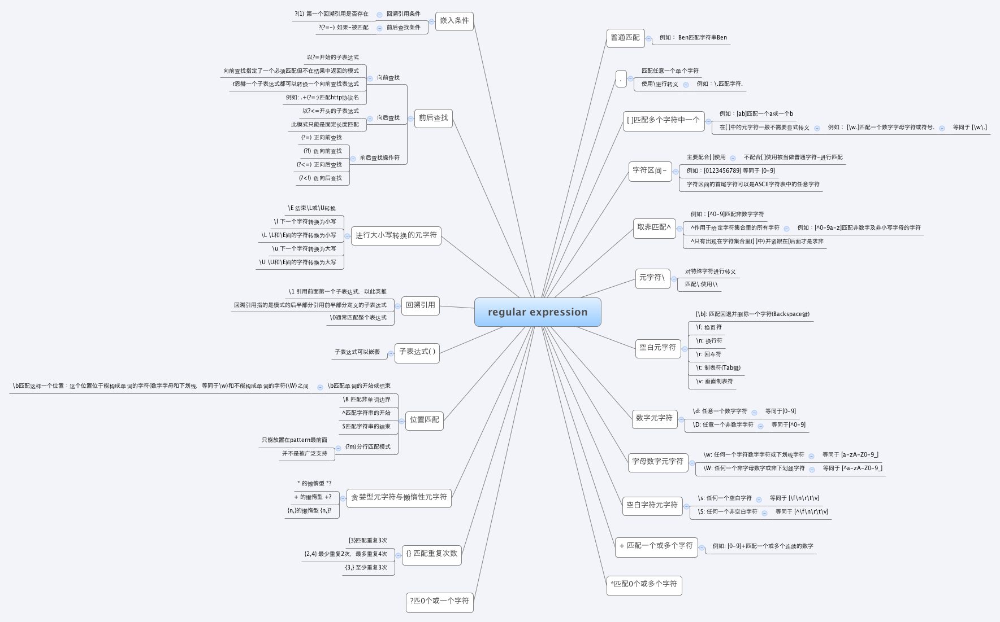

#linux文件`/`下目录结构和作用及其约束

#进程：
##获取系统所有进程信息
```
ps aux
```
##查看自己bash相关进程
```
ps -l
```
##动态查看进程资源变化
```
top
```
##进程树显示
```
pstree
```
##查看空闲资源
```
free
```
##系统内核相关信息查看
```
uname -a
```
##查看系统启动时间与工作负载
```
uptime   #1,5,15分钟区间的平均值
```
##获取某一个名称为tomcat的进程
```
ps aux |grep tomcat
```
##跟踪网络信息
```
netstat -tlnp
```
##通过端口号杀进程
```
ps -ef |grep portNum |awk '{print $2}'|xargs kill -9
```
##其他命令
* `dmesg`:分析内核产生的信息
* `vmstat`:检测系统资源变化
* `pidof pidname`:获取名称为`pidname`的进程号
* `lsof`:列出被进程所打开的文件名
  *由于所有进程存在于内存中，所有的进程信息都存在于`/proc/`下*.
#给某个文件夹加权限：
1. **给/tmp/test文件夹加admin用户：**

 ```
 chown admin /tmp/test 
 ```

2. **给/tmp下所有文件夹加admin用户：**

  ```
   chown  -R  admin /tmp/test 
  ```

#获取磁盘：
```shell
fdisk -l
```

```
df -h
```
#文件系统损坏，修复
```
fsck /dev/sda1
```
#忘记root用户密码
##重启时进入`grub`编辑编辑模式
在系统启动时，按任意键出现如下界面:

按`e`进入`grub`编辑模式:

##进入单用户模式
选中`kernel`那一行，按`e`进入`kernel`该行的编辑界面中，在出现的界面中，最后方输入`single`,如下：


完成后，再按下`b`就进入单用户模式了.

通过`passwd`进行修改.

#dd命令实现磁盘的写入和读取

```
nc –l 7000|dd of=/dev/sda 
```

当前机器开启端口7000，dd命令等待数据写入到/dev/sda

```
dd if=/dev/xvda bs=32M | nc 10.110.11.110 7000 
```

表示将/dev/xvda磁盘的文件写到上面的上机器(10.110.11.110)，通过端口7000

`dd`其实充当的是备份工具，可以将源磁盘的所有数据复制到目标磁盘，包括磁盘分区表信息.

#防火墙设置

##普通防火墙设置

1. 重启后永久性生效：

    `chkconfig iptables on` `chkconfig iptables off`


2. 即时生效，重启后失效：

　　`service iptables start` `service iptables stop`

##centos 7更改了防火墙规则，通过：

`systemctl stop firewalld.service`

关闭防火墙

##开放端口

`/sbin/iptables -I INPUT -p tcp --dport 8000 -j ACCEPT`

开启8000端口 

`/etc/rc.d/init.d/iptables save`

保存配置 

`/etc/rc.d/init.d/iptables restart`

重启服务 


`/etc/init.d/iptables status`

查看端口是否已经开放 

#远程复制

```shell
scp -r userName@ip:/filePath /destFilePath
```

#归档和压缩

##`zip，unzip`

 ```
 zip xxx.zip file (把file这个源文件压缩成xxx.zip是目标文件）
 unzip xxx.zip 是解压文件
 ```

##gzip

`gzip`也是一种压缩方式，各参数详解：

* `-c`打印压缩内容，可以重定向到新的文件
* `-d` 解压缩文件
* `-v` 显示压缩比
* `-#` `#`为1-9.9最慢，但压缩比做好
* `-t` 用来校验一个压缩文件的一致性，看看文件有无错误.

使用此压缩，只能压缩单一文件，当然可以递归压缩一个目录，但是还是针对单一文件进行压缩的.

```
gzip man.config
```

上述操作会将`man.config`压缩成`man.config.gz`文件，默认删除`man.config`,可以通过重定向不用删除`man.config`,即：

```
gzip -c man.config > man.config.gz
```

解压缩文件：

```
gzip -d man.config.gz
```

##bzip2

`bzip2`也是一种压缩方式，是为了优化`gzip`，参数使用和`gzip`基本一致，但是压缩比更好，压缩文件后缀名是`*.bz2`

```
bzip2 man.config
```

解压缩文件：

```
bzip2 -d man.config.bz2
```

##tar

一个归档命令，就是把许多文件打包成一个文件.各参数详解：

* `-c` 新建打包文件,可搭配`-v`查看过程中别打包的文件名
* `-t` 查看打包文件的内容含有那些文件名
* `-x` 解包或解压缩文件
* `-j` 打包时使用`bzip2`作为压缩工具,文件名`*.tar.bz2`
* `-z` 打包时使用`gzip`作为压缩工具,文件名`*.tar.gz`
* `-v` 在压缩/解压缩过程中显示处理的文件名
* `-f filename` `-f`后面要接被处理的文件名.最好`-f`单独写一个参数.
* `-C` 解压缩时使用，指定解压缩到指定的目录
* `-p` 保留压缩文件的原本权限和属性，常用于备份重要的配置文件.
* `-P` 保留绝对路径，即允许备份数据中含有根目录存在
* `--exclude=FILE` 在压缩的过程中，不将`FILE`打包

例示：

`-cvf out.tar liunxfile` :把Linuxfile这个文件夹中的文件打包归档成一个输出out.tar格式的文件，可以用来备份，但是他没有压缩哦

`-cvf out.tar` 把一个归档的tar文件释放到当前文件下

`-cvzf`: 在cvf命令下多了个z命令，就是归档并压缩一个文件。这里调用了一次gzip命令

格式：`tar -cvzf xxx.tar.gz/`要保存的目录下

其实用的最多的还是归档并压缩命令

解压：`tar -zxvf FileName.tar.gz`

压缩：`tar -zcvf FileName.tar.gz DirName`
#查找命令
##which
查找环境变量`PATH`指定目录下下的命令所在
```shell
[root@localhost /]# which ls
alias ls='ls --color=auto'
	/bin/ls
```
##whereis,locate
`whereis`和`locate`都是从数据库中查询，速度很快，一般首选这两命令，在找不到想要查找的文件的情况下才选择下面的`find`

```
[root@localhost /]# whereis tomcat
tomcat: /usr/local/tomcat
```

一般数据库一天更新一次，可以通过`udatedb`更新.

##find
`find dir -name filedesc` 

在目录dir下查找名字为filedesc的所有文件

#Shell
##变量作用域

`bash`中变量的作用域通过子进程是否继承父进程的变量(环境变量，自定义变量)来划分的.

环境变量能被子进程继承，自定义变量子进程不能继承，当进入子进程后，父进程睡眠，自定义变量隐藏，当然可以通过`export`将一个自定义变量设置为环境变量，从而子进程能够继承该变量,可以通过`unset`来取消变量的设置.

*`export`只列出环境变量，`env`亦然,`set`列出当前进程的环境变量和自定义变量*
##`VIM`命令
`yy`复制,`pp`粘贴,`ctrl+v`复制块,`0`文件头,`G`文件尾,`x`单个字符删除,`hlkg`左右上下移一个字符,`u`撤销操作,`:set nu`设置显示行号.

##`shell`语法

* `read`:实现与用户交互
* `declare`:声明一个变量，可以是整形(-i)，数组(-a)，环境变量(-x)等
* `cut`:截取处理
* `sort`:排序处理
* `wc`:显示行数，单词数，字符数
* `uniq`:去掉重复行，显示唯一
* `test`:判断语句,比如下面判断文件是否存在
  ```
  [root@localhost script]# test -e sh01.sh |echo $?
  0
  ```
* 条件判断语句与循环表达式

  使用`if else`实现条件判断

  ```

   #!/bin/bash

   #1.tell user function

  echo "This program will try to calculate:"

  echo "How many days before your demobilization date..."

  read -p "Please input your demobilization date (YYYYMMDD ex>20090401): "  date2

   #2.validate date pattern

  date_d=$(echo $date2 |grep '[0-9]\{8\}')

  if [ "$date_d" == "" ];then
  	echo "You input date format error"
  	exit 1
  elif [ "$date_d" =="123" ];then
  	echo "You input date format error"
  	exit 1
  else
  	echo "You input date format error"
  	exit 1
  fi
  ```

以上以`if`开头，结尾必须以`fi`结束.

对于多个固定值的可以使用`case`语法：

```shell
	 #!/bin/bash

	echo "This program will try to calculate:"

	echo "How many days before your demobilization date..."

	read -p "Please input your demobilization date (YYYYMMDD ex>20090401): "  date2

	date_d=$(echo $date2 |grep '[0-9]\{8\}')

	case $date_d in
	 "one")
		echo "You input date format error"
		exit 1;;
	 "two")
		echo "You input date format error"
		exit 1;;
	 *)
		echo "You input date format error"
		exit 1;;
	esac
```

  当然循环语句在任何一门语言中是少不了的，有两种形式的循环样式：

1. 不定循环

   ```shell
       while [ condition ] 
   	  do 
   		#dosomething   
   	  done
   ```

   ```shell
       until [ condition ]
   	  do
   		#dosomething
   	  done
   ```

2. 固定循环

   ```shell
   	for var in [ condition ]
   	  do
   		#dosomething
   	  done
   ```

## 正则表达式

