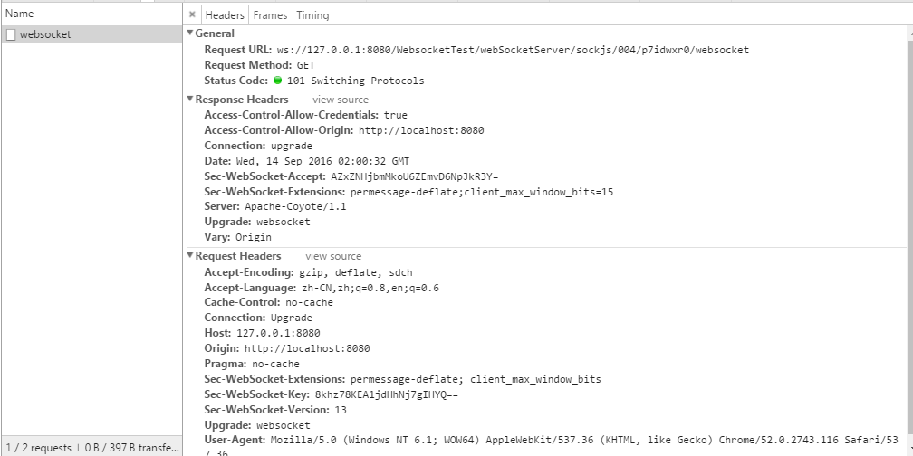

以前前后端交互，要保证交互良好，并且能准实时的处理业务，采用的往往是通过JS开一个线程，不停的去轮循请求后端，已达到准实时处理业务的目的.`websocket`的出现，很好的解决了上述方法处理延迟，前段负载较大，网络服务增长过快，后台压力大等问题，通过全双工通信机制，处理前后端的交互，后端有业务变更可以主动推送给前台，不需要前台不停的浪费资源去做轮循处理，能达到较高的实时性处理(不排除网络延迟).

`spring`从4.0开始对`websocket`有很好的支持，下面通过`spring`集成来示例`websocket`的实现过程,当然`spring`做了大量的工作.
#`spring`集成`websocket`
##需要依赖
```java
        <dependency>
			<groupId>org.springframework</groupId>
			<artifactId>spring-websocket</artifactId>
			<version>${springversion}</version>
		</dependency>
```
##配置websocket处理器
websocket处理器需要实现`WebSocketHandler`做一些连接相关，消息处理的事情,比如下面：
```java
public class LogWebSocketHandler implements WebSocketHandler {

	private static final ArrayList<WebSocketSession> users = new ArrayList<WebSocketSession>();

	@Override
	public void afterConnectionEstablished(WebSocketSession session) throws Exception {
		System.out.println("ConnectionEstablished");
		users.add(session);
        Map<String,Object> map=session.getAttributes();
        for(Entry<String,Object> entry:map.entrySet()){
        	System.out.println(entry.getKey()+"="+entry.getValue());
        }
		session.sendMessage(new TextMessage("connect"));
		session.sendMessage(new TextMessage("new_msg"));

	}

	@Override
	public void handleMessage(WebSocketSession session, WebSocketMessage<?> message) throws Exception {
		session.sendMessage(new TextMessage(new Date() + ""));
	}

	@Override
	public void handleTransportError(WebSocketSession session, Throwable exception) throws Exception {
		if (session.isOpen()) {
			session.close();
		}
		users.remove(session);
		System.out.println("handleTransportError" + exception.getMessage());
	}

	@Override
	public void afterConnectionClosed(WebSocketSession session, CloseStatus closeStatus) throws Exception {
		users.remove(session);
		System.out.println("afterConnectionClosed" + closeStatus.getReason());

	}

	@Override
	public boolean supportsPartialMessages() {
		return false;
	}

	/**
	 * 给所有在线用户发送消息
	 * 
	 * @param message
	 */
	public void sendMessageToUsers(TextMessage message) {
		for (WebSocketSession user : users) {
			System.out.println(user.getAttributes().get("USER_ID"));
			try {
				if (user.isOpen()) {
					user.sendMessage(message);
				}
			} catch (IOException e) {
				e.printStackTrace();
			}
		}
	}

	/**
     * 给某个用户发送消息
     *
     * @param userName
     * @param message
     */
    public void sendMessageToUser(String anoyUserId, TextMessage message) {
        for (WebSocketSession user : users) {
            if (user.getAttributes().get("USER_ID").equals(anoyUserId)) {
                try {
                    if (user.isOpen()) {
                        user.sendMessage(message);
                    }
                } catch (IOException e) {
                    e.printStackTrace();
                }
                break;
            }
        }
    }
}

```
##配置websocket请求拦截器
websocket请求拦截器需要实现`HandshakeInterceptor`来实现建立握手时的一些属性，请求拦截等处理.
```java

public class HandshakeInterceptorImpl implements HandshakeInterceptor {

	@Override
	public void afterHandshake(ServerHttpRequest request, ServerHttpResponse response, WebSocketHandler handler,
			Exception exception) {

	}

	@Override
	public boolean beforeHandshake(ServerHttpRequest request, ServerHttpResponse response, WebSocketHandler handler,
			Map<String, Object> map) throws Exception {
		if (request instanceof ServletServerHttpRequest) {
			ServletServerHttpRequest servletRequest = (ServletServerHttpRequest) request;
			/*
			 * getSession参数:
			 * 为true等价于不传值，表示当没有session时创建一个新的.
			 * 为false表示当没有session时不创建
			 */
			HttpSession session = servletRequest.getServletRequest().getSession(true);
			if (session != null) {
				String anoyUserId = session.getId();
				map.put("USER_ID", anoyUserId);
			}
			return true;
		}
		return false;
	}
}
```
##实现真正的websocket配置
webcsocket配置需要实现`WebSocketConfigurer`来注册处理机制，包括路径匹配，拦截器处理，消息处理等.
```java
@Configuration
@EnableWebSocket
public class WebSocketConfig implements WebSocketConfigurer {
	public void registerWebSocketHandlers(WebSocketHandlerRegistry registry) {
		registry.addHandler(systemWebSocketHandler(), "/webSocketServer")
				.addInterceptors(new HandshakeInterceptorImpl());
		registry.addHandler(systemWebSocketHandler(), "/webSocketServer/sockjs")
				.addInterceptors(new HandshakeInterceptorImpl()).setAllowedOrigins("*").withSockJS();
	}

	@Bean
	public WebSocketHandler systemWebSocketHandler() {
		return new LogWebSocketHandler();
	}
}
```
以上注册了不同请求路径对应的不同处理器,以及相应的拦截处理器.
当然上面通过`@Configuration`标识可以作为bean处理,`@EnableWebSocket`标识是一个`WebSocket`处理实现，但必须要在spring中配置扫描到这个文件,即
```java
<context:component-scan base-package="com.wyp.module.socketlink" />
```
来扫描所在包.


```java
registry.addHandler(systemWebSocketHandler(), "/webSocketServer")
                .addInterceptors(new HandshakeInterceptorImpl());
```
这个配置处理`websocket`，需要浏览器支持`websocket`.`systemWebSocketHandler`做处理,`HandshakeInterceptorImpl`做握手拦截处理.
```java
registry.addHandler(systemWebSocketHandler(), "/webSocketServer/sockjs")
                .addInterceptors(new HandshakeInterceptorImpl()).setAllowedOrigins("*").withSockJS();
```
这个可以处理浏览器不支持websocket的情况，通过`socketjs`处理，`AllowedOrigins`表示信任所有的来源.

##前端`WebSocket`处理
```javascript
//直接WebSocket
              //ws = new WebSocket('ws://127.0.0.1:8080/WebsocketTest/webSocketServer/');
              //SockJS处理
              ws = new SockJS("http://127.0.0.1:8080/WebsocketTest/webSocketServer/sockjs");
                
            ws.onopen = function () {
                setConnected(true);
                log('Info: connection opened.');
            };
            
            ws.onmessage = function (event) {
                log('Received: ' + event.data);
            };
            
            ws.onclose = function (event) {
                setConnected(false);
                log('Info: connection closed.');
                log(event);
            };
```
当然需要引入js文件
```javascript
<script src="http://cdn.sockjs.org/sockjs-0.3.min.js"></script>
```
##处理后请求示例
通过请求后观察请求头消息，通过`ws`来标识一个websocket请求.如下图：



##一些改良
在处理中，我们可以在后台做完业务处理主动请求前台做一些处理,比如下面在做某事是通过一段时间向前台发送一次数据
```java
@Bean
	public LogWebSocketHandler logWebSocketHandler(){
		return new LogWebSocketHandler();
	}
	
@RequestMapping(value = "/dosomething", method = RequestMethod.GET)
	public String userLogin(HttpServletRequest request) {
		logWebSocketHandler().sendMessageToUsers(new TextMessage("进入" + request.getSession().getId()));
		new Thread() {
			public void run() {
				int i=0;
				while(i<20){
					try {
						logWebSocketHandler().sendMessageToUsers(new TextMessage("这是第 "+i+" 次向前台发送消息"));;
						i++;
						Thread.sleep(1000);
					} catch (InterruptedException e) {
						e.printStackTrace();
					}
				}
			};
		}.start();
		return "index.jsp";
	}

```