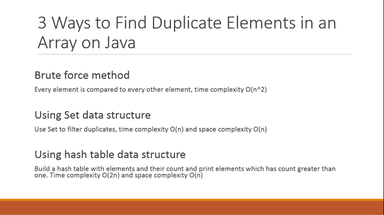

`java`集合类主要分为两大体系，继承自`Collection`的`List`和`Set`,还有自己作为根的`Map`.大体的结构如下.
```
Collection
├List
│├LinkedList
│├ArrayList
│└Vector
│　└Stack
└Set
 ├HashSet
 ├TreeSet
Map
├Hashtable
├HashMap
└TreeMap
└WeakHashMap

```

##Map

`HashMap`通过hashtable实现key-value的存储，按照key的hashCode存储，可以有null key,
`TreeMap`是有序的，通过key的Comparable比较器实现key-value的有序存储
`LinkedHashMap`也是有序的，也是通过key的hashCode存储，但是遍历是增加了有序属性，即与加入的顺序保持一致

###HashMap

`HashMap`是基于`hash`算法实现的，通过hash因子的作用，将元素"比较平均"的分散，以提高元素查找的命中率.具体的实现原理如下图：


`HashMap`是非线程安全的，允许`null key`,当`threshold=capacity*loadfactor`时会扩容为`capacity<<1`,这里`capacity`为桶的数量.


以下是`put<k,v>()`方法：


```java
public V put(K key, V value) {
    if (table == EMPTY_TABLE) {
        inflateTable(threshold);
    }
    if (key == null)
        return putForNullKey(value);
    int hash = hash(key);
    int i = indexFor(hash, table.length);
    for (Entry<K,V> e = table[i]; e != null; e = e.next) {
        Object k;
        if (e.hash == hash && ((k = e.key) == key || key.equals(k))) {
            V oldValue = e.value;
            e.value = value;
            e.recordAccess(this);
            return oldValue;
        }
    }

    modCount++;
    addEntry(hash, key, value, i);
    return null;
}
```


可以看到优先判断`null key`，然后计算`key`的`hash`值，通过`hash`值与`capacity`结合判断位于`Hash桶`的位置,然后判断是否有当前`key`的`Entry`,如果存在，替换`value`为新值，并返回旧的`value`，否则添加一个新的`Entry`,并且返回`null`，如果一个桶已有至少一个`Entry`，则会作为链表的第一个元素插入.

###HashTable

`HashTable`的原理与`HashMap`原理类似，只是比较特殊的所有操作加上了对当前对象操作的`synchronized`,以达到同步锁的功能，从而实现线程同步.


```java
public synchronized V put(K key, V value) {
    // Make sure the value is not null
    if (value == null) {
        throw new NullPointerException();
    }

    // Makes sure the key is not already in the hashtable.
    Entry tab[] = table;
    int hash = hash(key);
    int index = (hash & 0x7FFFFFFF) % tab.length;
    for (Entry<K,V> e = tab[index] ; e != null ; e = e.next) {
        if ((e.hash == hash) && e.key.equals(key)) {
            V old = e.value;
            e.value = value;
            return old;
        }
    }

    modCount++;
    if (count >= threshold) {
        // Rehash the table if the threshold is exceeded
        rehash();

        tab = table;
        hash = hash(key);
        index = (hash & 0x7FFFFFFF) % tab.length;
    }

    // Creates the new entry.
    Entry<K,V> e = tab[index];
    tab[index] = new Entry<>(hash, key, value, e);
    count++;
    return null;
}

 private int hash(Object k) {
        // hashSeed will be zero if alternative hashing is disabled.
        return hashSeed ^ k.hashCode();
    }
```


从上可知,`HashTable`不允许加入`null key`,`null value`.

还有一个就是，`HashTable`初始容量是11.

###Hashset

`Hashset`本应不在`map`系列,但由于`Hashset`的实现是基于`HashMap`实现的，所以这里列出，

```java
// Dummy value to associate with an Object in the backing Map
private static final Object PRESENT = new Object();

/**
 * Constructs a new, empty set; the backing <tt>HashMap</tt> instance has
 * default initial capacity (16) and load factor (0.75).
 */
public HashSet() {
    map = new HashMap<>();
}

public boolean add(E e) {
    return map.put(e, PRESENT)==null;
}
```


从上可以看出,每次`add`一个元素，其实是将该元素当做一个`key`存入`Hashmap`中,`value`为一个"dummy value"(一个`Object`对象).所以其实是通过`Hashmap`保证了元素的唯一.

##LinkedList与Queue

```java
public class LinkedList<E>
    extends AbstractSequentialList<E>
    implements List<E>, Deque<E>, Cloneable, java.io.Serializable
```

可知`LinkedList`实现了`Deque`，而`Deque`是丰富了父接口`Queue`，
`Queue`是Collection接口的子类，`Collection`实现了`Iterable`,所以是可遍历的。

而`Map`没有实现`Iterable`，但是通过一系列方法如`entrySet()`等转换成集合类`Set`来实现遍历功能.

## Arraylist

`Arraylist`的实现是基于数组的，初始数组大小为10,容量不足时扩展为原来的`1.5`倍.

##ConcurrentModificationException while Iterating over ArrayList


##3 ways to find duplicate elements in an array Java



